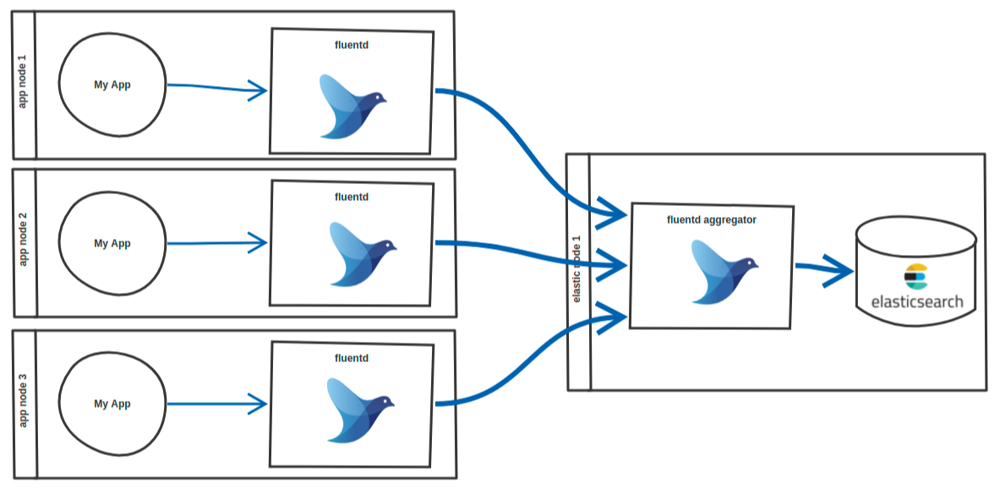

release time :2021-11-30 16:36


> Read https://kubernetes.io/zh/docs/concepts/cluster-administration/logging/ before reading this article

# Fluentd logging architecture


A typical deployment architecture of Fluentd needs to include two different roles: forwarder and aggregator.


Each Kubernetes working node deploys a Fluentd to forward the node's container logs to the edge cloud configuration public network working node, configure the public network working node and then forward the log to the software deployment node.

# Fluent configuration file

The configuration of Fluentd for each Kubernetes worker node is as follows:

    <source>
    @type tail
    path /var/log/containers/*.log
    pos_file /var/log/fluentd-containers.log.pos
    format json
    tag kubernetes.*
    time_format %Y-%m-%dT%H:%M:%S.%NZ
    </source>

    <match kubernetes.**>
    @type forward
    send_timeout 60s
    recover_wait 10s
    hard_timeout 60s
    <server>
        name myserver1
        host 192.168.200.100
        port 24224
        weight 60
    </server>
    </match>


The aggregation log node, that is, the working node Fluentd configured with the public network in the above figure, is configured as follows:

    <source>
    @type forward
    port 24224
    bind 0.0.0.0
    </source>

    <match **>
    @type forward
    send_timeout 60s
    recover_wait 10s
    hard_timeout 60s
    <server>
        name myserver2
        host 36.134.56.149
        port 24224
        weight 60
    </server>
    </match>


The configuration of the software deployment node Fluentd is as follows:

    <source>
    @type forward
    port 24224
    bind 0.0.0.0
    </source>

    <match **>
    @type stdout
    </match>


The log rollback configuration is as follows:

    # cat /etc/logrotate.d/cmp-pod
    /tmp/ftp_path/log_pod/*.log {
        missingok
        copytruncate
        rotate 30
        compress
        dateext
        dateformat -%Y%m%d-%H-%s
        sharedscripts
    }
    #  cat /etc/cron.d/cmp-pod 
    # Run system activity accounting tool every 10 minutes
    SHELL=/bin/bash
    PATH=/sbin:/bin:/usr/sbin:/usr/bin
    MAILTO=root
    */5 * * * * root logrotate -f /etc/logrotate.d/cmp-pod


# Record several problems encountered in the process of collecting Pod logs with Fluentd
## Compared with bare metal and container deployment, adopt container deployment solution
Bare metal can also be deployed, but requires a ruby ​​environment, as well as Fluent dependencies, including version dependencies, deployment is a bit cumbersome, and it is not conducive to automation. If container deployment is adopted, the above disadvantages do not exist, and the kind: DaemonSet of Kubernetes can be used to conveniently start the Fluentd service on each Kubernetes node.

The container image uses docker pull fluent/fluentd:latest.
You can also use fluent/fluentd-kubernetes-daemonset, which should be better. Some configurations should be configured. I did my own research and used the original image.
You can also directly use the resource list of the addon plug-in officially provided by Kubernetes at the address: https://github.com/kubernetes/kubernetes/blob/master/cluster/addons/fluentd-elasticsearch/ and install it directly.

The following command starts the container

    docker run -it -d   -p 24224:24224   -v /path/to/conf:/fluentd/etc   -v /var:/var fluent/fluentd:latest


The initial startup failed because there is no configuration file (the host's /path/to/conf directory overwrites the fluentd configuration file directory in the container), plus the Fluentd configuration file, the container restarted successfully.

In order to test the Fluent log service, two small experiments were done.

**input: tail**

After the Fluent configuration file is written as follows, restart the Fluentd container.

    # Directive determines the input sources
    # Watches source and triggers an event with a tag attached to it
    <source>
    @type tail                                               # Uses tail plugin to read logs from
    format json                                              # Assumes that the log file is in "json" format
    read_from_head true                                      # Start to read the logs from the head of file, not bottom
    tag api.user.registration                                # Tag triggered event with "api.user.registration"
    path /home/ubuntu/logs/application/registration.log*     # Paths to the files which will be tailed
    pos_file /home/ubuntu/logs/fluentd/registration.log.pos  # Path to the "position" database file
    </source>
    
    # Directive determines the output destinations
    # Catches an event with a specific tag attached to it
    <match api.user.registration>
    @type file                                               # Uses file plugin to write logs to
    path /home/ubuntu/logs/fluentd/registration.log          # Path to the log file which logs will be written to
    </match>


test was successful.

    ubuntu@linux:~$ echo '{"user":"1"}' >> logs/application/registration.log.1 
    ubuntu@linux:~$ echo '{"user":"2"}' >> logs/application/registration.log.1 
    ubuntu@linux:~$ echo '{"user":"3"}' >> logs/application/registration.log.1 

    ubuntu@linux:~$ ls -l logs/fluentd/
    
    -rw-r--r-- 1 td-agent td-agent 61 Apr  6 21:02 registration.log.20180406.b56933893cd87b6b8
    -rw-r--r-- 1 td-agent td-agent 83 Apr  6 21:02 registration.log.pos

    ubuntu@linux:~$ cat logs/fluentd/registration.log.20180406.b56933893cd87b6b8
    
    2018-04-06T21:02:30+01:00	api.user.registration	{"user":"1"}
    2018-04-06T21:02:49+01:00	api.user.registration	{"user":"2"}
    2018-04-06T21:02:55+01:00	api.user.registration	{"user":"3"}

    ubuntu@linux:~$ touch logs/application/registration.log.2
    
    ubuntu@linux:~$ echo '{"admin":"1"}' >> logs/application/registration.log.2
    ubuntu@linux:~$ echo '{"admin":"2"}' >> logs/application/registration.log.2
    ubuntu@linux:~$ echo '{"admin":"3"}' >> logs/application/registration.log.2

    ubuntu@linux:~$ cat logs/fluentd/registration.log.20180406.b56933893cd87b6b8
    
    2018-04-06T21:02:30+01:00	api.user.registration	{"user":"1"}
    2018-04-06T21:02:49+01:00	api.user.registration	{"user":"2"}
    2018-04-06T21:02:55+01:00	api.user.registration	{"user":"3"}
    2018-04-06T21:07:37+01:00	api.user.registration	{"admin":"1"}
    2018-04-06T21:07:37+01:00	api.user.registration	{"admin":"2"}
    2018-04-06T21:07:38+01:00	api.user.registration	{"admin":"3"}


**input: forward**

After the Fluent configuration file is written as follows, restart the Fluentd container.

    <source>
    @type   forward
    </source>

    <match *>

    @type              file

    path               /fluentd/log/${tag}/${tag}
    append             true
    <format>
        @type            single_value
        message_key      log
    </format>
    <buffer tag,time>
        @type             file
        timekey           1d
        timekey_wait      10m
        flush_mode        interval
        flush_interval    30s
    </buffer>
    </match>


Start a new container, specify the logging driver of the container

    docker run -d \
    ...
    --log-driver=fluentd \
    --log-opt fluentd-address=<fluentdhost>:24224 \
    --log-opt mode=non-blocking \
    --log-opt tag={{.Name}} \
    <image>


Observe the log, and you can see a directory structure similar to this in the /home/ubuntu/container-logs directory:

    .
    └── <container-name>
        └── <container-name>.20190123.log


## The log file of the pod can be cated in the Fluentd container, but the log report of the Fluentd service cannot read the log file of the pod

    /var/log/containers/samplelog-79bd66868b-t7xn9_logging1_fluentd-70e85c5d6328e7d.log unreadable. It is excluded and would be examined next time.

Log in to the Fluentd container to cat log files. After reading the read and write attributes of the log files, the root user can read them, but other users cannot read them. ps the Fluentd process and found that they are all running as the fluent user.

    / # ps -ef
    PID   USER     TIME  COMMAND
        1 root      0:00 {entrypoint.sh} /usr/bin/dumb-init /bin/sh /bin/entrypoint.sh /bin/sh -c exec fluentd -c /fluentd/etc/${FLUENTD_CONF} -p /fluentd/plugins $FLUENTD_
        6 fluent    0:02 {fluentd} /usr/bin/ruby /usr/bin/fluentd -c /fluentd/etc/fluent.conf -p /fluentd/plugins
    17 fluent    0:28 /usr/bin/ruby -Eascii-8bit:ascii-8bit /usr/bin/fluentd -c /fluentd/etc/fluent.conf -p /fluentd/plugins --under-supervisor
    21 root      0:00 sh
    26 root      0:00 ps -ef
    / # 


Because the fluentd image is built with fluent user privileges, insufficient privileges may occur.

The solution is to pull the fluent code to build it yourself and specify the user in the Dockfile; or use the simplest method to specify the UID of the fluent user as 0 in the env. I have an answer to this question on stackoverflow for the specific operation method.

https://stackoverflow.com/questions/51671212/fluentd-log-unreadable-it-is-excluded-and-would-be-examined-next-time/70165516#70165516

The most direct way is to change mode:

    chmod 777 /var/log/containers/*.log

but the best way is: change fluent user to root (set FLUENT_UID environment variable to 0 in your docker/kubernetes configuration);

add –env FLUENT_UID=0 to docker command, for example:

    docker run -it -d -p 24224:24224 -v /path/to/conf:/fluentd/etc -v /var:/var --env FLUENT_UID=0 fluent/fluentd:latest


or add to Kubernetes yaml file:

```yaml
apiVersion: extensions/v1beta1
kind: DaemonSet
metadata:
  name: fluentd
  namespace: kube-system
  # namespace: default
  labels:
    k8s-app: fluentd-logging
    version: v1
    kubernetes.io/cluster-service: "true"
spec:
  template:
    metadata:
      labels:
        k8s-app: fluentd-logging
        version: v1
        kubernetes.io/cluster-service: "true"
    spec:
      serviceAccount: fluentd
      serviceAccountName: fluentd
      tolerations:
      - key: node-role.kubernetes.io/master
        effect: NoSchedule
      containers:
      - name: fluentd
        image: fluent/fluentd-kubernetes-daemonset:v1.4-debian-elasticsearch
        env:
          - name: FLUENT_UID  # change this place
            value: "0"
```

After modifying as per my answer on stackoverflow, everything works fine.

    / # ps -ef
    PID   USER     TIME  COMMAND
        1 root      0:00 {entrypoint.sh} /usr/bin/dumb-init /bin/sh /bin/entrypoint.sh /bin/sh -c exec fluentd -c /fluentd/etc/${FLUENTD_CONF} -p /fluentd/plugins $FLUENTD_
        7 root      0:05 {fluentd} /usr/bin/ruby /usr/bin/fluentd -c /fluentd/etc/fluent.conf -p /fluentd/plugins
    16 root      1:58 /usr/bin/ruby -Eascii-8bit:ascii-8bit /usr/bin/fluentd -c /fluentd/etc/fluent.conf -p /fluentd/plugins --under-supervisor
    22 root      0:00 sh
    28 root      0:00 ps -ef
    / # 

