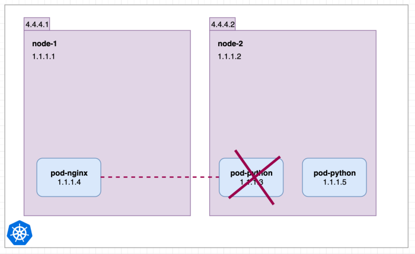
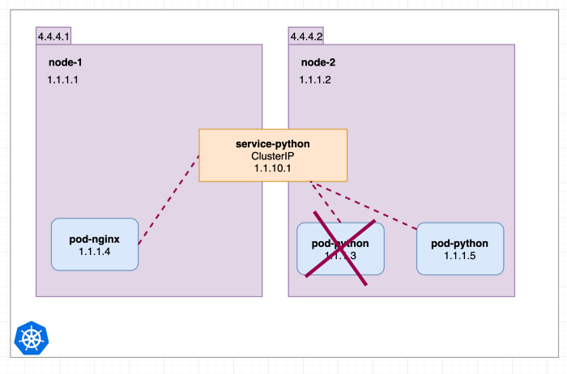
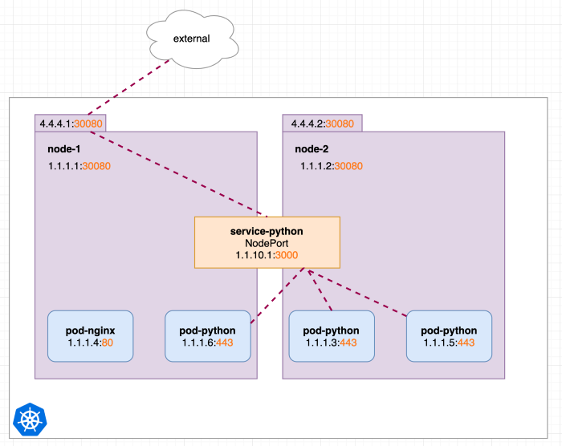
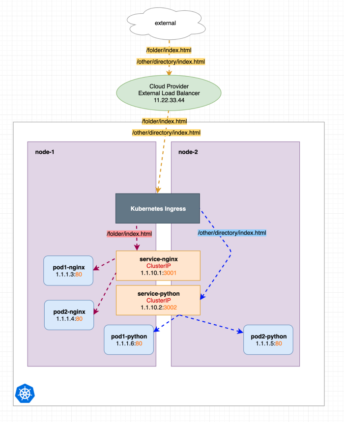
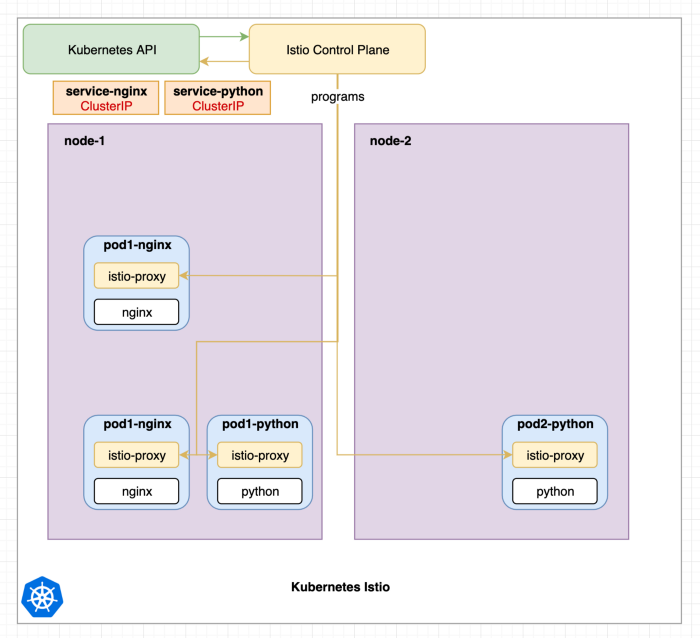
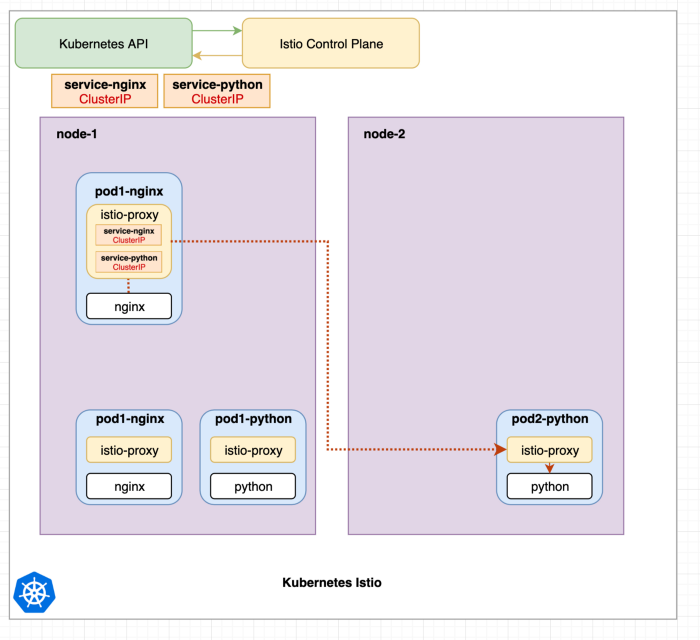

release time :2022-09-02 13:12

This article briefly introduces Kubernetes internal Service, Kubernetes Ingress, and Kubernetes Istio in order.

# Kubernetes Internal Service
ClusterIP, NodePort, ExternalIPs and LoadBalancer services are provided by kube-proxy or CNI such as Cilium, Calico.

If you create a NodePort service, it also creates a ClusterIP service. If you create a LoadBalancer, it creates a NodePort and then a ClusterIP.

Why there is a Kubernetes internal Service:

In the situation above, if pod-python is destroyed and a new one is created. (In this article, we do not discuss how to manage and control pods.) Suddenly pod-nginx can no longer reach 1.1.1.3. With Service or Cluster IP, the situation is different.

Now the service can only be accessed internally by the cluster. In order to be accessible externally, NodePort can be configured. This way the internal service python is now also accessible from each node's internal and external IP addresses on port 30080.

Kubernetes Ingress
Kubernetes Ingress is not a Kubernetes service. It's an Nginx Pod that redirects requests to other internal (ClusterIP) services.

Ingress-nginx composition:
* ingress-nginx-controller: According to the ingress rules written by the user (the created ingress yaml file), dynamically change the configuration file of the nginx service, and reload to make it effective (automated, realized by lua script);
* Ingress resource object: abstract the configuration of Nginx into an Ingress object. Every time you add a new Service resource object, you only need to write a new yaml file of the Ingress rule (or modify the yaml file of the existing ingress rule)

What Kubernetes Ingress can do:

It is somewhat similar to the work of Kubernetes Service. Like the traditional Nginx work content, the HTTP protocol receives requests for specific file paths and redirects HTTP protocol requests and returns their responses. Realize dynamic configuration services and reduce unnecessary port mapping.

For example, you can configure different URLs /folder /other to be forwarded to different Kubernetes Services.

    apiVersion: networking.k8s.io/v1beta1
    kind: Ingress
    metadata:
    annotations:
        kubernetes.io/ingress.class: nginx
    namespace: default
    name: test-ingress
    spec:
    rules:
    - http:
        paths:
        - path: /folder
            backend:
            serviceName: service-nginx
            servicePort: 3001
    - http:
        paths:
        - path: /other
            backend:
            serviceName: service-python
            servicePort: 3002 

# That's Kubernetes
Istio is a service mesh that allows for more detailed, sophisticated, and observable communication between pods and services in a cluster. It injects proxy containers into all pods and then controls traffic in the cluster.

Services in Kubernetes are implemented by kube-proxy components running on each node. This component creates iptables rules that redirect requests to pods. Therefore, services are nothing more than iptables rules. 

The image above shows Istio installed, which ships with the Istio control plane. It is also common that each pod has a second container called istio-proxy that is automatically injected into the pod during creation. Pods with istio-proxy will no longer use these kube-proxy components.

istio-proxy The Istio control plane configures all sidecars whenever configuration or serviced pods change. Similar to the Kubernetes API to configure kube-proxy. The Istio control plane implements its own routing using pod ip. Istio will translate Kubernetes service declarations into its own route declarations.

Next, let's see how to use Istio to make a request:

In the image above, all istio-proxy containers have been configured by the Istio control plane and contain all necessary routing information. The nginx container from pod1-nginx makes a request to service service-python.

The request is intercepted by the istio-proxy container pod1-nginx and redirected to the istio-proxy container of a python pod, which then redirects it to the python container.

It can be seen that Istio and Kubernetes internal Service and Kubernetes internal Service have many overlapping functions, or they can be multiple implementations of the same requirements. What are the advantages of Istio over Kubernetes Service and Kubernetes Ingress?

All traffic is routed through the istio-proxy containers in each pod. Whenever istio-proxy receives and redirects a request, it also submits information about it to the Istio control plane. So the Istio control plane knows exactly which pod the request is coming from, what HTTP headers are present, how long it takes from one request to istio-proxy to another, etc. In a cluster with many services communicating with each other, this improves observability and better control over all traffic.

The specific advantages are:
* Advanced Routing: Kubernetes internal services can only round-robin or randomly distribute service requests to Pods. A more sophisticated approach can be * implemented using Istio. Like redirecting based on request headers if an error occurs or using minimal services.
* Deployment: It allows routing certain percentages of traffic to certain service versions, thus allowing green/blue and canary deployments.
* Encryption: Intra-cluster traffic between pods from istio-proxy to istio-proxy can be encrypted.
* Monitoring/Graph Generation: Istio connects to monitoring tools like Prometheus. It also works nicely with Kiali to display all services and their traffic.
* Tracing: Since the Istio control plane has a lot of data about requests, this data can be traced and inspected using tools such as Jaeger.
* Multi-cluster mesh: Istio has an internal service registry that can consume existing Kubernetes services. It is also possible to add resources from outside the cluster, and even connect different clusters into a grid.

# Summarize
To sum up, ingress is the request entry of k8s cluster, which can be understood as the re-abstraction of multiple services. Generally speaking, ingress generally consists of two parts: ingress resource object and ingress-controller. Istio does not replace Kubernetes internal services, Istio uses existing Kubernetes internal services to obtain all its endpoints/pod IP addresses. Istio can replace Kubernetes Ingress. Istio provides new resources, such as Gateway and VirtualService, and even comes with an ingress converter istioctl convert-ingress.

# Attachment: ingress-nginx deploy&test

    # 创建集群
    [root@centos7 ~]# kind create cluster
    Creating cluster "kind" ...
    ✓ Ensuring node image (kindest/node:v1.24.0) 🖼
    ✓ Preparing nodes 📦  
    ✓ Writing configuration 📜 
    ✓ Starting control-plane 🕹️ 
    ✓ Installing CNI 🔌 
    ✓ Installing StorageClass 💾 
    Set kubectl context to "kind-kind"
    You can now use your cluster with:

    kubectl cluster-info --context kind-kind

    Thanks for using kind! 😊
    # 检查集群状态
    [root@centos7 ~]# kubectl get node -o wide
    NAME                 STATUS   ROLES           AGE   VERSION   INTERNAL-IP   EXTERNAL-IP   OS-IMAGE       KERNEL-VERSION               CONTAINER-RUNTIME
    kind-control-plane   Ready    control-plane   32s   v1.24.0   172.18.0.2    <none>        Ubuntu 21.10   5.19.5-1.el7.elrepo.x86_64   containerd://1.6.4
    [root@centos7 ~]# kubectl get po -A -o wide
    NAMESPACE            NAME                                         READY   STATUS    RESTARTS   AGE   IP           NODE                 NOMINATED NODE   READINESS GATES
    kube-system          coredns-6d4b75cb6d-4ck55                     1/1     Running   0          19s   10.244.0.3   kind-control-plane   <none>           <none>
    kube-system          coredns-6d4b75cb6d-ps5sf                     1/1     Running   0          19s   10.244.0.2   kind-control-plane   <none>           <none>
    kube-system          etcd-kind-control-plane                      1/1     Running   0          34s   172.18.0.2   kind-control-plane   <none>           <none>
    kube-system          kindnet-fbjj6                                1/1     Running   0          19s   172.18.0.2   kind-control-plane   <none>           <none>
    kube-system          kube-apiserver-kind-control-plane            1/1     Running   0          34s   172.18.0.2   kind-control-plane   <none>           <none>
    kube-system          kube-controller-manager-kind-control-plane   1/1     Running   0          34s   172.18.0.2   kind-control-plane   <none>           <none>
    kube-system          kube-proxy-rz9vk                             1/1     Running   0          19s   172.18.0.2   kind-control-plane   <none>           <none>
    kube-system          kube-scheduler-kind-control-plane            1/1     Running   0          34s   172.18.0.2   kind-control-plane   <none>           <none>
    local-path-storage   local-path-provisioner-9cd9bd544-xddpx       1/1     Running   0          19s   10.244.0.4   kind-control-plane   <none>           <none>
    # 部署 ingress-nginx
    [root@centos7 ~]# kubectl apply -f https://raw.githubusercontent.com/kubernetes/ingress-nginx/controller-v1.3.0/deploy/static/provider/cloud/deploy.yaml
    namespace/ingress-nginx created
    serviceaccount/ingress-nginx created
    serviceaccount/ingress-nginx-admission created
    role.rbac.authorization.k8s.io/ingress-nginx created
    role.rbac.authorization.k8s.io/ingress-nginx-admission created
    clusterrole.rbac.authorization.k8s.io/ingress-nginx created
    clusterrole.rbac.authorization.k8s.io/ingress-nginx-admission created
    rolebinding.rbac.authorization.k8s.io/ingress-nginx created
    rolebinding.rbac.authorization.k8s.io/ingress-nginx-admission created
    clusterrolebinding.rbac.authorization.k8s.io/ingress-nginx created
    clusterrolebinding.rbac.authorization.k8s.io/ingress-nginx-admission created
    configmap/ingress-nginx-controller created
    service/ingress-nginx-controller created
    service/ingress-nginx-controller-admission created
    deployment.apps/ingress-nginx-controller created
    job.batch/ingress-nginx-admission-create created
    job.batch/ingress-nginx-admission-patch created
    ingressclass.networking.k8s.io/nginx created
    validatingwebhookconfiguration.admissionregistration.k8s.io/ingress-nginx-admission created
    # 检查 ingress-nginx 状态
    [root@centos7 ~]# kubectl get po -A -o wide
    NAMESPACE            NAME                                         READY   STATUS      RESTARTS   AGE     IP           NODE                 NOMINATED NODE   READINESS GATES
    ingress-nginx        ingress-nginx-admission-create-ddgdc         0/1     Completed   0          59s     10.244.0.5   kind-control-plane   <none>           <none>
    ingress-nginx        ingress-nginx-admission-patch-6tfbk          0/1     Completed   0          59s     10.244.0.6   kind-control-plane   <none>           <none>
    ingress-nginx        ingress-nginx-controller-6bf7bc7f94-k94c4    1/1     Running     0          59s     10.244.0.7   kind-control-plane   <none>           <none>
    kube-system          coredns-6d4b75cb6d-4ck55                     1/1     Running     0          2m55s   10.244.0.3   kind-control-plane   <none>           <none>
    kube-system          coredns-6d4b75cb6d-ps5sf                     1/1     Running     0          2m55s   10.244.0.2   kind-control-plane   <none>           <none>
    kube-system          etcd-kind-control-plane                      1/1     Running     0          3m10s   172.18.0.2   kind-control-plane   <none>           <none>
    kube-system          kindnet-fbjj6                                1/1     Running     0          2m55s   172.18.0.2   kind-control-plane   <none>           <none>
    kube-system          kube-apiserver-kind-control-plane            1/1     Running     0          3m10s   172.18.0.2   kind-control-plane   <none>           <none>
    kube-system          kube-controller-manager-kind-control-plane   1/1     Running     0          3m10s   172.18.0.2   kind-control-plane   <none>           <none>
    kube-system          kube-proxy-rz9vk                             1/1     Running     0          2m55s   172.18.0.2   kind-control-plane   <none>           <none>
    kube-system          kube-scheduler-kind-control-plane            1/1     Running     0          3m10s   172.18.0.2   kind-control-plane   <none>           <none>
    local-path-storage   local-path-provisioner-9cd9bd544-xddpx       1/1     Running     0          2m55s   10.244.0.4   kind-control-plane   <none>           <none>
    [root@centos7 ~]# kubectl get pods --namespace=ingress-nginx
    NAME                                        READY   STATUS      RESTARTS   AGE
    ingress-nginx-admission-create-ddgdc        0/1     Completed   0          73s
    ingress-nginx-admission-patch-6tfbk         0/1     Completed   0          73s
    ingress-nginx-controller-6bf7bc7f94-k94c4   1/1     Running     0          73s
    # 测试 ingress-nginx
    [root@centos7 ~]# kubectl create deployment demo --image=httpd --port=80
    deployment.apps/demo created
    [root@centos7 ~]# kubectl expose deployment demo
    service/demo exposed
    [root@centos7 ~]# kubectl get svc -A
    NAMESPACE       NAME                                 TYPE           CLUSTER-IP      EXTERNAL-IP   PORT(S)                      AGE
    default         demo                                 ClusterIP      10.96.179.60    <none>        80/TCP                       56s
    default         kubernetes                           ClusterIP      10.96.0.1       <none>        443/TCP                      4m40s
    ingress-nginx   ingress-nginx-controller             LoadBalancer   10.96.170.222   <pending>     80:32137/TCP,443:30208/TCP   2m27s
    ingress-nginx   ingress-nginx-controller-admission   ClusterIP      10.96.139.192   <none>        443/TCP                      2m27s
    kube-system     kube-dns                             ClusterIP      10.96.0.10      <none>        53/UDP,53/TCP,9153/TCP       4m38s
    [root@centos7 ~]# kubectl get po
    NAME                    READY   STATUS    RESTARTS   AGE
    demo-6486d57d96-j65cf   1/1     Running   0          94s
    [root@centos7 ~]# kubectl create ingress demo-localhost --class=nginx \
    >   --rule="demo.localdev.me/*=demo:80"
    ingress.networking.k8s.io/demo-localhost created
    [root@centos7 ~]# kubectl get ingress -A
    NAMESPACE   NAME             CLASS   HOSTS              ADDRESS   PORTS   AGE
    default     demo-localhost   nginx   demo.localdev.me             80      8s
    [root@centos7 ~]# kubectl port-forward --namespace=ingress-nginx service/ingress-nginx-controller 8080:80
    Forwarding from 127.0.0.1:8080 -> 80
    Forwarding from [::1]:8080 -> 80
    [root@centos7 ~]# curl http://demo.localdev.me:8080/
    <html><body><h1>It works!</h1></body></html>

