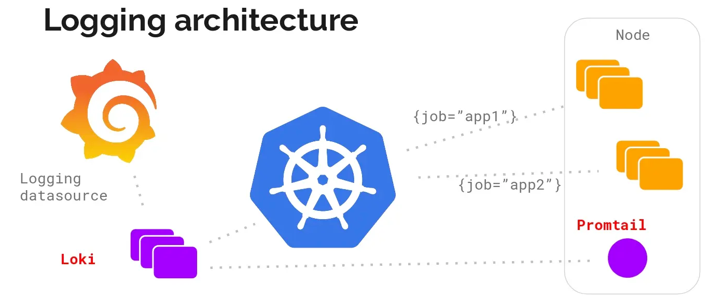
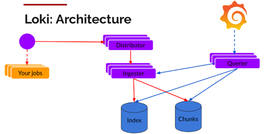
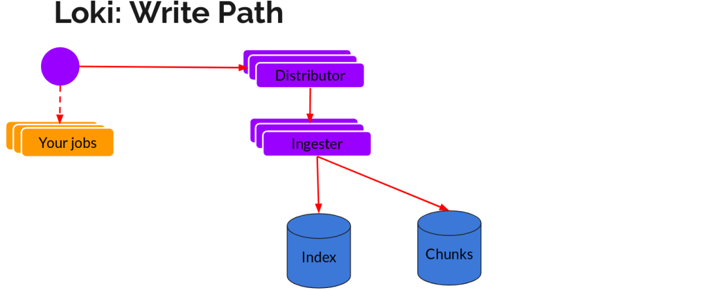
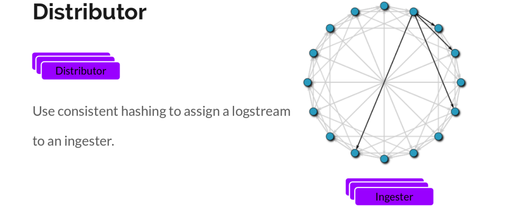
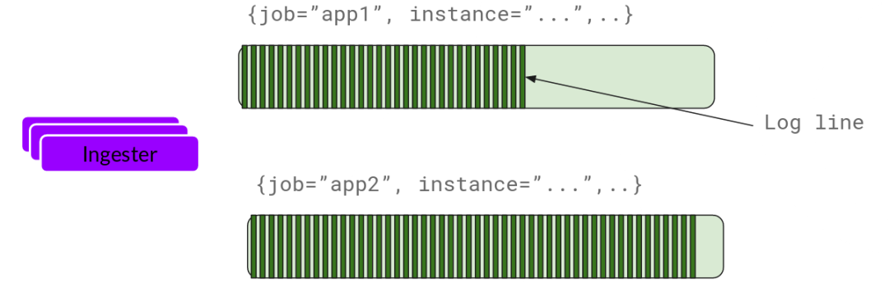
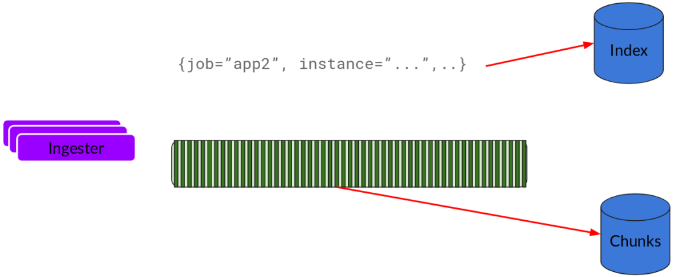
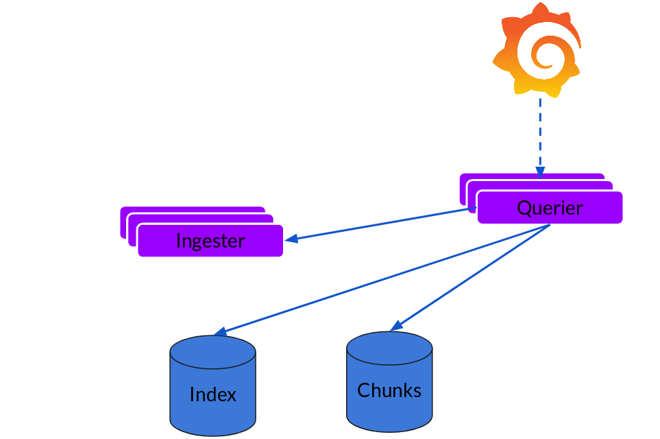
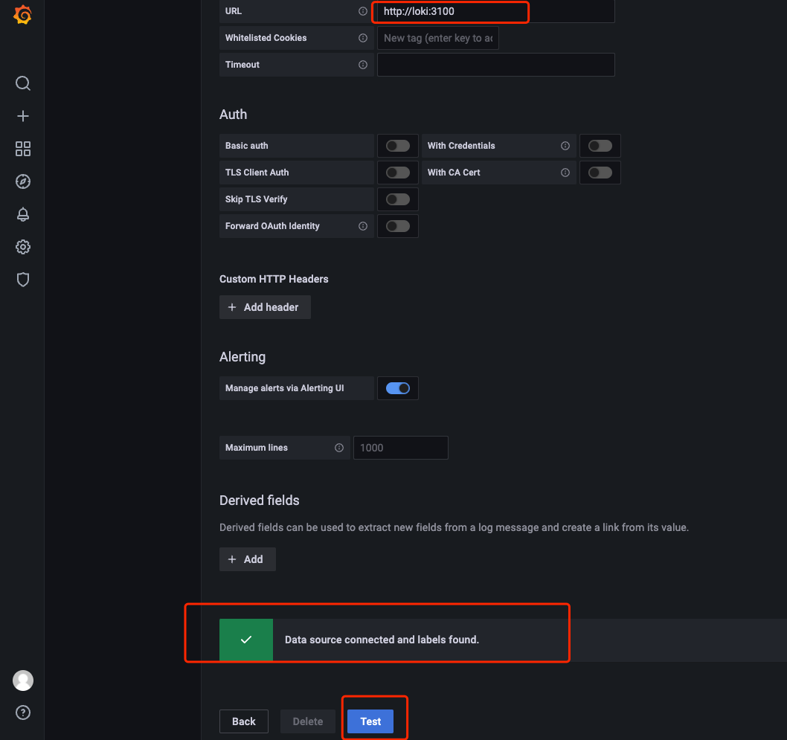
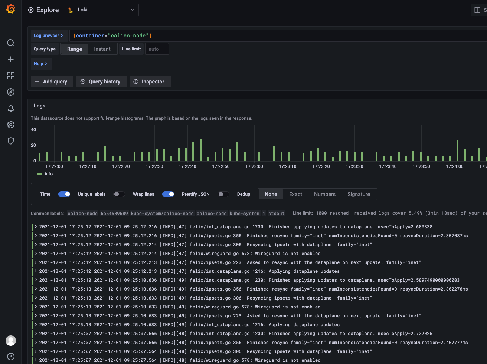
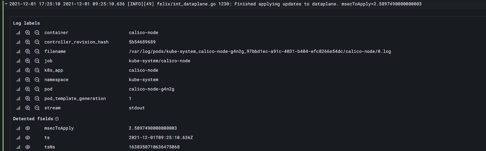

release time :2021-12-01 17:48

> Read https://kubernetes.io/zh/docs/concepts/cluster-administration/logging/ before reading this article

I wrote an article about Fluentd designing a set of log architecture to implement Kubernetes Pod log collection . Since EFK is no longer the current mainstream log architecture, I studied another more mainstream log system promtail + loki + Grafana.

# Why introduce a logging system
The Kubernetes Pod itself will generate logs, and you can view the corresponding logs. Why is the log system introduced?

For the sake of log reliability, because the application suddenly hangs up, we cannot find relevant logs at this time, so we need to introduce a log system to collect logs uniformly.

Second, after the scale is large, acquisition, centralized management, storage, indexing, query, and display are all problems, and a system solution is needed.

# promtail + loki + Grafana log architecture

The PLG log system consists of the following three parts:
* Promtail is a custom client for Loki, responsible for collecting logs and sending them to Loki.
* Loki is the master server responsible for storing logs and handling queries.
* Grafana is used for UI display (you can develop the front-end page yourself instead).

The PLG log structure is customized for Kubernetes Pod logs, which is the only choice for Kubernetes Pod logs. The advantages over ELK/EFK are obvious.

In addition, because the alarm and monitoring of Kubernetes are based on Prometheus, if you use ELK, you need to switch between Kibana and Grafana, which affects the user experience. Therefore, the first purpose of loki is to minimize the switching cost of metrics and logs, which helps to reduce the response time of abnormal events and improve user experience.

# Loki Architecture

* The Promtail open source client is responsible for collecting and reporting logs;
* Distributor: the log is written to the entry, and the data is forwarded to Ingester;
* Ingester: log writing service, cache and write log content and index to the underlying storage;
* Querier: log reading service, execute search request.

## read and write
The writing of log data mainly relies on two components, Distributor and Ingester. The overall process is as follows:

# Distributor
Once promtail collects logs and sends them to loki, Distributor is the first component to receive logs. Since log write volumes can be large, they cannot be written to the database as they come in. This will destroy the database. We need to batch and compress data.

Loki achieves this by building compressed data blocks by gziping the logs when they enter. The component ingester is a stateful component responsible for building and refreshing chunks. When the chunks reach a certain amount or time, they are refreshed to storage to go. Each flow log corresponds to an ingester. When the log reaches the Distributor, it calculates which ingester it should go to based on the metadata and the hash algorithm.

Also, we replicate it n (3 by default) times for redundancy and resilience.

## Ingester
Ingester receives the logs and starts building chunks:

Basically, the log is compressed and appended to the chunk. Once the chunk is "filled" (the data reaches a certain amount or a certain period has passed), the ingester flushes it to the database. We use separate databases for blocks and indexes because they store different types of data.

After flushing a chunk, the ingester then creates a new empty chunk and adds new entries to that chunk.

# Querier
Reading is very simple. Given a time range and label selector, Querier looks at the index to determine which blocks match, and displays the results through greps. It also fetches the latest data from Ingester which has not been refreshed yet.

For each query, a queryer will show you all related logs. Query parallelization is implemented, providing distributed grep so that even large queries are adequate.

> You can refer to the official document Loki's Architecture for further in-depth understanding. Finally, in one sentence, Loki is like Prometheus, but for logs.

# PLG deployment

    #  helm upgrade --install loki --namespace=loki grafana/loki-stack  --set grafana.enabled=true
    Release "loki" does not exist. Installing it now.
    Error: failed to download "grafana/loki-stack”

If you are in China and it is difficult to pull images from the official DockerHub, you can use a mirror repository hosted on Alibaba Cloud:

    #  helm upgrade --install loki --namespace=loki grafana/loki-stack  --set grafana.enabled=true --set  manager.image.repository=openkruise-registry.cn-hangzhou.cr.aliyuncs.com/openkruise/kruise-manager

    Release "loki" does not exist. Installing it now.
    NAME: loki
    LAST DEPLOYED: Wed Dec  1 15:34:23 2021
    NAMESPACE: loki
    STATUS: deployed
    REVISION: 1
    NOTES:
    The Loki stack has been deployed to your cluster. Loki can now be added as a datasource in Grafana.

    See http://docs.grafana.org/features/datasources/loki/ for more detail.

#Query PLG Service Status

    # kubectl -n loki get all
    NAME                                READY   STATUS    RESTARTS   AGE
    pod/loki-0                          1/1     Running   0          27m
    pod/loki-grafana-688db6c776-s8lxc   1/1     Running   0          27m
    pod/loki-promtail-2g6dp             1/1     Running   0          27m
    pod/loki-promtail-2th87             1/1     Running   0          27m
    pod/loki-promtail-46rbc             1/1     Running   0          27m
    pod/loki-promtail-8zljs             1/1     Running   0          27m
    pod/loki-promtail-gn8hf             1/1     Running   0          27m
    pod/loki-promtail-mc44v             1/1     Running   0          27m

    NAME                    TYPE        CLUSTER-IP      EXTERNAL-IP   PORT(S)    AGE
    service/loki            ClusterIP   10.233.5.180    <none>        3100/TCP   27m
    service/loki-grafana    ClusterIP   10.233.13.165   <none>        80/TCP     27m
    service/loki-headless   ClusterIP   None            <none>        3100/TCP   27m

    NAME                           DESIRED   CURRENT   READY   UP-TO-DATE   AVAILABLE   NODE SELECTOR   AGE
    daemonset.apps/loki-promtail   6         6         6       6            6           <none>          27m

    NAME                           READY   UP-TO-DATE   AVAILABLE   AGE
    deployment.apps/loki-grafana   1/1     1            1           27m

    NAME                                      DESIRED   CURRENT   READY   AGE
    replicaset.apps/loki-grafana-688db6c776   1         1         1       27m

    NAME                    READY   AGE
    statefulset.apps/loki   1/1     27m

It can be seen that the installation of the Promtail + Loki + Grafana combination is automatically completed after deployment through Helm. The Promtail deployment mode is daemonset, which is deployed on each computing node to collect log information on nodes and Pods.

Loki itself is deployed by statefulset by default. This is to avoid index loss when the data ingestion component crashes. Therefore, it is officially recommended to run Loki through statefulset and use persistent storage to store index files.

Next, visit the Grafana UI interface to view the deployment results. First, get the Grafana administrator's password with the following command:

    $ kubectl get secret --namespace loki loki-grafana -o jsonpath="{.data.admin-password}" | base64 --decode ; echo

Then forward Grafana's interface through the following command for access through the Web UI. By default, the address of port forwarding is localhost, you can add –address <IP address> according to the situation of the instance where kubectl is located.

    $ kubectl port-forward --namespace loki service/loki-grafana 3000:80

# Login display page
Since PLG is deployed in Kubernetes, the service of Kubernetes is an internal ip, and a port mapping is made so that the external network can access the Grafana UI.

    # nohup ssh -N -g -L 33043:10.233.13.165:80 36.133.53.67 -p22 2>&1 &

