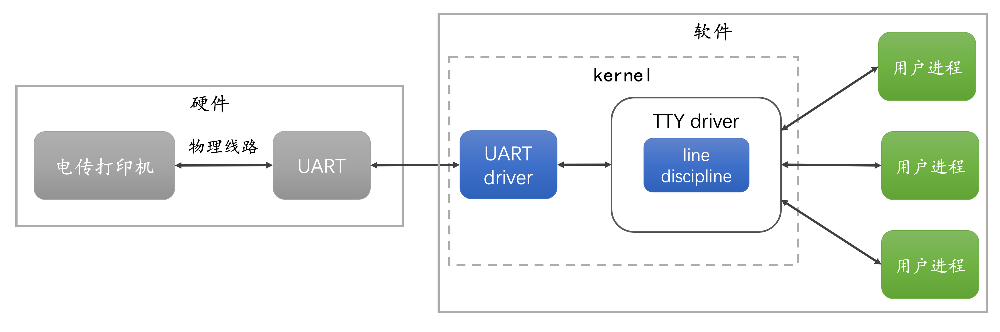
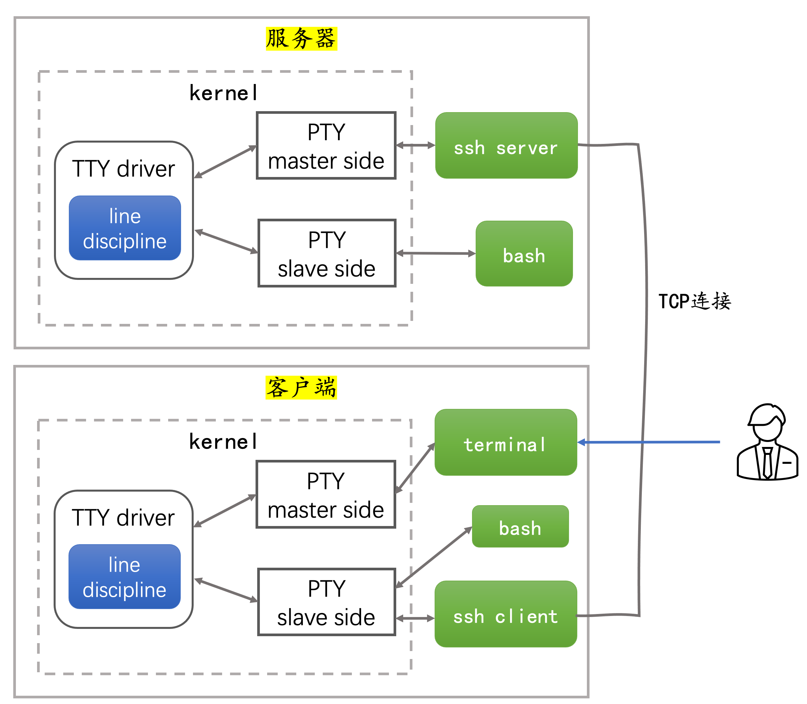
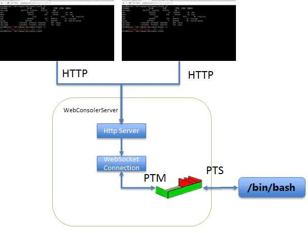

release time :2022-08-17 18:53

# TTY and PTY
## review history
Decades ago, people connected Teleprinters (teletypewriters) to early mainframe computers as input and output devices, sending incoming data to the computer and printing out responses.

Teletypewriters have input devices and output devices, corresponding to the keys and paper tape on the teletypewriter.

In order to connect different types of teletypewriters to computers, drivers need to be installed in the operating system kernel to shield all low-level details for upper-level applications.

Teletypewriters were connected by two cables: one for sending instructions to the computer, and one for receiving output from the computer. These two cables are plugged into the UART (Universal Asynchronous Receiver and Transmitter, Universal Asynchronous Receiver and Transmitter) serial interface to the computer.

The operating system includes a UART driver that manages the physical transfer of bytes, including parity and flow control. The input character sequence is then passed to the TTY driver, which contains a line discipline.

The line discipline is responsible for translating special characters (such as backspaces, erasures, blank lines) and sending received content back to the teletype so that the user can see what was typed. The line discipline is also responsible for buffering characters, and when the Enter key is pressed, the buffered data is passed to the foreground user process associated with the TTY. Users can execute several processes in parallel, but only interact with one process at a time, while other processes work in the background.




## terminal emulator
Today the teletypewriter has entered the museum, but Linux/Unix still retains the design and function of the original TTY driver and line discipline. A terminal is no longer a physical device that needs to be connected to a computer via a UART. The terminal becomes a module of the kernel, which can send characters directly to the TTY driver, and read the response from the TTY driver and print it to the screen. That is, a kernel module is used to emulate a physical terminal device, hence the name terminal emulator.


## pseudo terminal (pseudo terminal, PTY)
Terminal emulator (terminal emulator) is a module that runs in the kernel, and we can also let the terminal emulator run in the user area. The terminal emulation program running in the user area is called a pseudo terminal (pseudo terminal, PTY).

PTY runs in the user area, which is more secure and flexible, while still retaining the functions of TTY driver and line discipline. Commonly used pseudo-terminals include xterm, gnome-terminal, and remote terminal ssh. We take the gnome-terminal provided by the Ubuntu desktop version as an example to introduce how the pseudo-terminal interacts with the TTY driver.


PTY is created by opening a special device file /dev/ptmx, which consists of a pair of bidirectional character devices called PTY master and PTY slave.

gnome-terminal holds the file descriptor /dev/ptmx of the PTY master. gnome-terminal is responsible for listening to keyboard events, receiving or sending characters to PTY slave through PTY master, and drawing character output from PTY master on the screen.

gnome-terminal will fork a shell subprocess and let the shell hold the device file /dev/pts/[n] of the PTY slave. The shell receives characters through the PTY slave and outputs the processing results.

There is a TTY driver between PTY master and PTY slave, which will copy data between master and slave, and perform session management and provide line discipline function.

Execute the tty command in gnome-terminal, and you can see the device file representing the PTY slave:

    [root@kubevirtci web-console]# tty
    /dev/pts/0


Execute the ps -l command, and you can also confirm that the pseudo-terminal associated with the shell is pts/0:

    [root@kubevirtci web-console]# ps -l
    F S   UID     PID    PPID  C PRI  NI ADDR SZ WCHAN  TTY          TIME CMD
    4 S     0    1091    1090  0  80   0 -  1923 do_wai pts/0    00:00:00 bash
    4 R     0   20771    1091  0  80   0 -  2523 -      pts/0    00:00:00 ps


> Note that the TTY column indicates that the terminal of the current process is pts/0.

Let's take a practical example to see the whole process of executing a command in the terminal.
* We start the terminal program gnome-terminal on the desktop, it requests a PTY master from the operating system, and draws the GUI on the monitor
* gnome-terminal starts subprocess bash
* The standard input, standard output and standard error of bash are all set to PTY slave
* gnome-terminal listens for keyboard events and sends typed characters to the PTY master
* The line discipline receives characters and buffers them. It will copy the buffered characters to the PTY slave only when you press enter.
* When line discipline receives characters, it also writes characters back to the PTY master. gnome-terminal will only display stuff from the PTY master on the screen. * Therefore, the line discipline needs to return characters so that you can see what you just typed.
* The TTY driver is responsible for copying the buffered data to the PTY slave when you press enter
* bash reads input characters from standard input (eg ls -l ). Note that bash has set the standard input to PTY slave when it starts
* bash interprets the characters it reads from the input and finds that it needs to run ls
* bash fork out the ls process. The process of bash fork has the same standard input, standard output and standard error as bash, that is, PTY slave
* ls runs, and the result is printed to standard output, which is the PTY slave
* TTY driver copies characters to PTY master
* The gnome-terminal loop reads bytes from the PTY master to draw to the user interface.

## remote terminal
We often connect to a remote host through ssh. At this time, the ssh server on the remote host is a pseudo-terminal PTY, which also holds the PTY master, but the ssh server no longer listens to keyboard events and draws output results on the screen, but Send or receive characters to or from the ssh client over a TCP connection.




Let's briefly review how the remote terminal executes commands.
1. The user enters the ssh command in the terminal of the client, passes through the PTY master and TTY drive, and reaches the PTY slave. The standard input of bash has been set as PTY slave, it reads the character sequence from the standard input and interprets it, finds that the ssh client needs to be started, and requests to establish a TCP connection with the remote server.
2. The server receives the client's TCP connection request, applies to the kernel to create a PTY, and obtains a pair of device file descriptors. Let the ssh server hold the PTY master, and the child process bash forked from the ssh server hold the PTY slave. The standard input, standard output and standard error of bash are all set to PTY slave.
3. When the user enters the command ls -l and the Enter key in the terminal of the client, these characters reach the TTY driver through the PTY master. We need to disable all the rules of the client line discipline, that is to say, the client's line discipline will not process the special character enter key, but let the command ls -l and the enter key reach the PTY slave together. The ssh client reads the character sequence from the PTY slave and sends it to the ssh server through the network.
4. The ssh server writes bytes received from the TCP connection to the PTY master. The TTY driver buffers bytes until the special character Enter is received.
5. Since the line discipline on the server side does not disable the echo rule, the TTY driver will also write the received characters back to the PTY master, and the ssh server will read the characters from the PTY master and send them back to the client through the TCP connection. Note that the characters sent back are not the execution result of the ls -l command, but the echo of ls -l itself, so that the client can see its own input.
6. On the server side, the TTY driver transmits the character sequence to the PTY slave, and bash reads the characters from the PTY slave, interprets and executes the command ls -l. bash fork out ls child process, the standard input, standard output and standard error of this child process are also set to PTY slave. The execution result of the ls -l command is written to the standard output PTY slave, and then the execution result reaches the PTY master through the TTY driver, and then is sent to the ssh client by the ssh server through the TCP connection.

> Note that on the client side, all the characters we see on the screen come from the remote server. Including the content we entered, it is also the result of the echo rule applied by the line discipline on the remote server, and these characters are echoed back.

> If you want to explore further, you can read the source code of the TTY driver https://github.com/torvalds/linux/blob/master/drivers/tty/tty_io.c and the source code of line discipline https://github.com/torvalds/linux/ blob/master/drivers/tty/n_tty.c


# Reading and writing of PTY master/slave implemented in go language
> The code is placed at: https://github.com/backendcloud/example/tree/master/pts

```go
package main

import (
    "fmt"
    "os"
    "strconv"
    "syscall"
    "unsafe"
)

func ioctl(fd, cmd, ptr uintptr) error {
    _, _, e := syscall.Syscall(syscall.SYS_IOCTL, fd, cmd, ptr)
    if e != 0 {
        return e
    }
    return nil
}


func ptsname(f *os.File) (string, error) {
    var n uint32
    err := ioctl(f.Fd(), syscall.TIOCGPTN, uintptr(unsafe.Pointer(&n)))
    if err != nil {
        return "", err
    }
    return "/dev/pts/" + strconv.Itoa(int(n)), nil
}

func unlockpt(f *os.File) error {
    var u int32
    // use TIOCSPTLCK with a zero valued arg to clear the slave pty lock
    return ioctl(f.Fd(), syscall.TIOCSPTLCK, uintptr(unsafe.Pointer(&u)))
}

func StartPty() (pty, tty *os.File, err error) {
    p, err := os.OpenFile("/dev/ptmx", os.O_RDWR | syscall.O_NOCTTY, 0)
    if err != nil {
        return nil, nil, err
    }

    sname, err := ptsname(p)
    if err != nil {
        return nil, nil, err
    }

    err = unlockpt(p)
    if err != nil {
        return nil, nil, err
    }

    fmt.Println("sname is :", sname)
    t, err := os.OpenFile(sname, os.O_RDWR|syscall.O_NOCTTY, 0)
    if err != nil {
        return nil, nil, err
    }


    return p, t, nil
}


func main() {
    m, s, err := StartPty()
    if  err != nil {
        fmt.Printf("start pty: " , err)
        os.Exit(-1)
    }
    defer m.Close()
    defer s.Close()

    n, err := m.Write([]byte("hello world!\n")) ;
    fmt.Printf("write master, %d:%v\n", n, err)

    buf := make([]byte, 256)
    n, err = s.Read(buf)
    fmt.Println("read from slave:", string(buf[0:n]))


    n, err = s.Write([]byte("slave!\n"))
    fmt.Printf("write slave, %d:%v\n", n, err)
    n, err = m.Read(buf[:])
    fmt.Println("read from master:", string(buf[0:n]))
}
```

Results of the:

    [root@kubevirtci pts]# go run main.go 
    sname is : /dev/pts/3
    write master, 13:<nil>
    read from slave: hello world!

    write slave, 7:<nil>
    read from master: hello world!

    [root@kubevirtci pts]# 


# Web Terminal
> First of all, let me make it clear that the Web Terminal mentioned here refers to something that is implemented in a web page and is similar to terminal client software.

With the previous foreshadowing, we can easily implement WebConsole based on WebSocket. The specific architecture diagram is as follows:



Implementing Web Terminal The current mainstream implementation solution is: on the browser side, it is necessary to embed the xterm.js plug-in to realize the input and output support capabilities of the terminal. The server uses node-pty as a PTY operation tool. In terms of communication, SSH uses TCP, and what can be used on the Web is WebSocket.

* https://github.com/xtermjs/xterm.js
* https://github.com/microsoft/node-pty
* https://github.com/socketio/socket.io
* https://github.com/ysk2014/webshell

