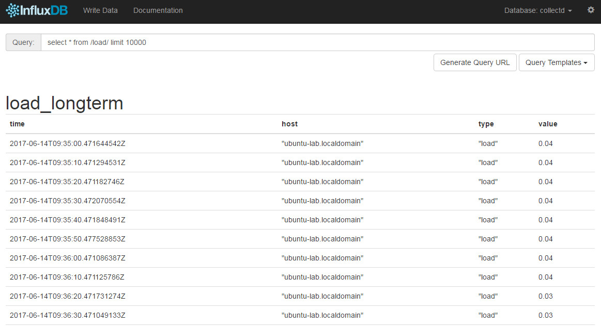

release time :2017-06-15 06:47

# update package

    $ sudo apt-get update
    $ sudo apt-get upgrade
    $ sudo reboot

# install influxdb

    hanwei@ubuntu-lab:~$ wget https://dl.influxdata.com/influxdb/releases/influxdb_1.2.4_amd64.deb
    --2017-06-14 16:37:09--  https://dl.influxdata.com/influxdb/releases/influxdb_1.2.4_amd64.deb
    Resolving dl.influxdata.com (dl.influxdata.com)... 52.84.167.167, 52.84.167.39, 52.84.167.178, ...
    Connecting to dl.influxdata.com (dl.influxdata.com)|52.84.167.167|:443... connected.
    HTTP request sent, awaiting response... 200 OK
    Length: 17305080 (17M) [application/x-debian-package]
    Saving to: ‘influxdb_1.2.4_amd64.deb’

    influxdb_1.2.4_amd64.deb         100%[========================================================>]  16.50M   875KB/s    in 19s     

    2017-06-14 16:37:29 (874 KB/s) - ‘influxdb_1.2.4_amd64.deb’ saved [17305080/17305080]

    hanwei@ubuntu-lab:~$ sudo dpkg -i influxdb_1.2.4_amd64.deb
    [sudo] password for hanwei: 
    Selecting previously unselected package influxdb.
    (Reading database ... 63342 files and directories currently installed.)
    Preparing to unpack influxdb_1.2.4_amd64.deb ...
    Unpacking influxdb (1.2.4-1) ...
    Setting up influxdb (1.2.4-1) ...
    Created symlink from /etc/systemd/system/influxd.service to /lib/systemd/system/influxdb.service.
    Created symlink from /etc/systemd/system/multi-user.target.wants/influxdb.service to /lib/systemd/system/influxdb.service.
    Processing triggers for man-db (2.7.5-1) ...
    hanwei@ubuntu-lab:~$ service influxdb start
    ==== AUTHENTICATING FOR org.freedesktop.systemd1.manage-units ===
    Authentication is required to start 'influxdb.service'.
    Authenticating as: hanwei,,, (hanwei)
    Password: 
    ==== AUTHENTICATION COMPLETE ===
    hanwei@ubuntu-lab:~$ service influxdb status
    ● influxdb.service - InfluxDB is an open-source, distributed, time series database
    Loaded: loaded (/lib/systemd/system/influxdb.service; enabled; vendor preset: enabled)
    Active: active (running) since Wed 2017-06-14 16:50:05 CST; 4s ago
        Docs: https://docs.influxdata.com/influxdb/
    Main PID: 2156 (influxd)
        Tasks: 7
    Memory: 4.9M
        CPU: 49ms
    CGroup: /system.slice/influxdb.service
            └─2156 /usr/bin/influxd -config /etc/influxdb/influxdb.conf 

# Modify the influxdb configuration file

    hanwei@ubuntu-lab:~$ vim /etc/influxdb/influxdb.conf
    [admin]
    # Determines whether the admin service is enabled.
    # enabled = false

    # The default bind address used by the admin service.
    # bind-address = ":8083"

    # Whether the admin service should use HTTPS.
    # https-enabled = false

change to: 

    enabled = true
    bind-address = ":8083"

# Create database Collectd in infuxdb

Two ways CLI or web ui

http://192.168.206.144:8086/query?q=CREATE+DATABASE+%22collectd%22&db=collectd

or use web ui

# Install collectd

    $ sudo apt-get install collectd

Configure Collectd as the client, and send the collected data directly to InfluxDB

    $ sudo vi /etc/collectd/collectd.conf
    ...
    LoadPlugin network
    ...
    <Plugin network>
            Server "192.168.2.183" "25826"
    </Plugin>
    ...

Restart collectd:

    $ sudo /etc/init.d/collectd restart

# Configure the Collectd plugin that comes with InfluxDB

The Collectd plug-in that comes with InfluxDB is disabled by default. It needs to be manually configured to enable enabled = true, and fill in the line database = "collectd". The "collectd" here is the database we created above. Remember to restart InfluxDB after changing the configuration

    $ sudo vim /etc/influxdb/shared/influxdb.conf
    ...
    # Configure the collectd api
    [input_plugins.collectd]
    enabled = true
    # address = "0.0.0.0" # If not set, is actually set to bind-address.
    # port = 25826
    database = "collectd"
    # types.db can be found in a collectd installation or on github:
    # https://github.com/collectd/collectd/blob/master/src/types.db
    # typesdb = "/usr/share/collectd/types.db" # The path to the collectd types.db file
    ...
    hanwei@ubuntu-lab:~$ sudo service influxdb restart

Check the port opened on the server and you will find that the influxdb plug-in has started a 25826 port. If you find that there is no (collected) data in the InfluxDB database, be sure to check whether the 25826 port is started normally

    hanwei@ubuntu-lab:~$ sudo netstat -tupln
    Active Internet connections (only servers)
    Proto Recv-Q Send-Q Local Address           Foreign Address         State       PID/Program name
    tcp        0      0 192.168.122.1:53        0.0.0.0:*               LISTEN      1649/dnsmasq    
    tcp        0      0 0.0.0.0:22              0.0.0.0:*               LISTEN      1308/sshd       
    tcp        0      0 127.0.0.1:5432          0.0.0.0:*               LISTEN      1437/postgres   
    tcp        0      0 127.0.0.1:6010          0.0.0.0:*               LISTEN      1740/0          
    tcp        0      0 127.0.0.1:6011          0.0.0.0:*               LISTEN      10471/1         
    tcp6       0      0 :::8083                 :::*                    LISTEN      10490/influxd   
    tcp6       0      0 :::8086                 :::*                    LISTEN      10490/influxd   
    tcp6       0      0 :::22                   :::*                    LISTEN      1308/sshd       
    tcp6       0      0 :::8088                 :::*                    LISTEN      10490/influxd   
    tcp6       0      0 ::1:5432                :::*                    LISTEN      1437/postgres   
    tcp6       0      0 ::1:6010                :::*                    LISTEN      1740/0          
    tcp6       0      0 ::1:6011                :::*                    LISTEN      10471/1         
    udp        0      0 0.0.0.0:53466           0.0.0.0:*                           10239/collectd  
    udp        0      0 192.168.122.1:53        0.0.0.0:*                           1649/dnsmasq    
    udp        0      0 0.0.0.0:67              0.0.0.0:*                           1649/dnsmasq    
    udp        0      0 0.0.0.0:68              0.0.0.0:*                           1250/dhclient   
    udp6       0      0 :::25826                :::*                                10490/influxd

# Check if InfluxDB has data from Collectd

InfluxDB is ready to accept and process data from Collectd. Use the command line or the web management interface to verify whether there is data in the database

    hanwei@ubuntu-lab:~$ influx
    Connected to http://localhost:8086 version 1.2.4
    InfluxDB shell version: 1.2.4
    > show databases;
    name: databases
    name
    ----
    _internal
    mydb
    > use collectd
    Using database collectd
    > show measurements
    name: measurements
    name
    ----
    cpu_value
    df_value
    disk_io_time
    disk_read
    disk_value
    disk_weighted_io_time
    disk_write
    entropy_value
    interface_rx
    interface_tx
    irq_value
    load_longterm
    load_midterm
    load_shortterm
    memory_value
    processes_value
    swap_value
    users_value
    > SELECT * from cpu_value
    ...
    7435180464451600 ubuntu-lab.localdomain 0        cpu  nice          722
    1497435180464452775 ubuntu-lab.localdomain 0        cpu  interrupt     0
    1497435180464454083 ubuntu-lab.localdomain 0        cpu  softirq       339
    1497435180464454592 ubuntu-lab.localdomain 0        cpu  steal         0
    1497435180464455103 ubuntu-lab.localdomain 0        cpu  idle          592750
    1497435190462593838 ubuntu-lab.localdomain 0        cpu  user          4281
    1497435190462598610 ubuntu-lab.localdomain 0        cpu  system        5599
    1497435190462600580 ubuntu-lab.localdomain 0        cpu  wait          7799
    1497435190462602296 ubuntu-lab.localdomain 0        cpu  nice          722
    1497435190462603649 ubuntu-lab.localdomain 0        cpu  interrupt     0
    1497435190462604905 ubuntu-lab.localdomain 0        cpu  softirq       339
    1497435190462605510 ubuntu-lab.localdomain 0        cpu  steal         0
    1497435190462606004 ubuntu-lab.localdomain 0        cpu  idle          593745
    1497435200463552177 ubuntu-lab.localdomain 0        cpu  user          4285
    1497435200463557277 ubuntu-lab.localdomain 0        cpu  system        5608
    1497435200463558626 ubuntu-lab.localdomain 0        cpu  wait          7799
    1497435200463560045 ubuntu-lab.localdomain 0        cpu  nice          722
    1497435200463561496 ubuntu-lab.localdomain 0        cpu  interrupt     0
    1497435200463562866 ubuntu-lab.localdomain 0        cpu  softirq       339
    ...

or web ui

