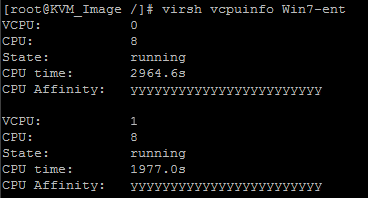
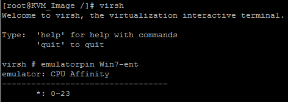
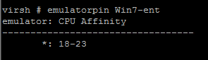
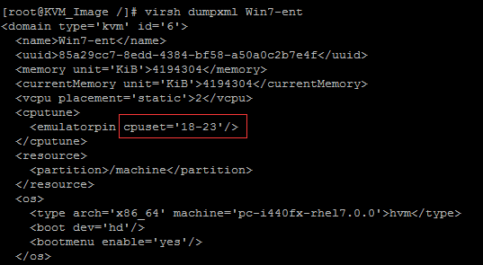
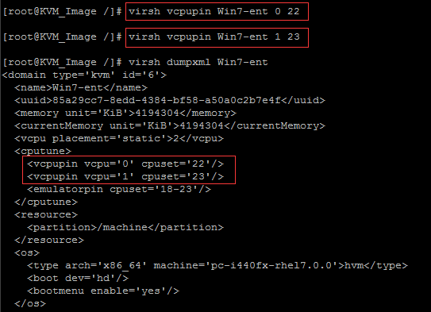
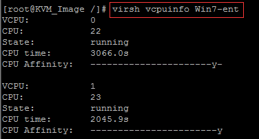

release time :2017-07-20 18:30

Since our operating system and CPU features adopt the NUMA architecture, we can optimize the KVM CPU by adjusting the NUMA relationship corresponding to KVM. Here, we generally do related operations through the method of CPU binding.

Virtual machine vCPU core binding affinity: Support the affinity policy between virtual machine vCPU and physical CPU core, VCPU and physical CPU are bound one by one, different VMs run on different physical CPUs, that is, physical CPUs are not shared between VMs , to avoid performance degradation and uncertainty caused by over-allocation.

For example, if we want to see the vCPU corresponding to the physical CPU in this Win7-ent virtual machine, we can run: `# virsh vcpuinfo Win7-ent` can view.

This virtual machine has 2 vCPU dual-core, and then they all run on the CPU8 of the physical machine, and the usage time is 2964.6s. The last one is the affinity of the CPU. This yyyyy represents the logical core inside the physical CPU used, and a y represents one of the CPU logical cores. All are y, which means that the 24 CPU cores of this physical machine can be scheduled and used.

You can enter vrish, and then run emulatorpin Win7-ent. Through this command, we can get the cores that this virtual machine can use in more detail:

We can see that the current CPU of this virtual machine 0-23 can be scheduled for use

Then the above is to check the virtual machine CPU NUMA scheduling information. If we want to bind the virtual machine to a fixed CPU, we need to do the following: # virsh emulatorpin Win7-ent 18-23 –live Through this command, we put This win7 virtual machine vCPU is bound to the cores between the 6 CPUs of 18-23.

We use the command to check emulatorpin Win7-ent

You can also use virsh dumpxml Win7-ent to check and confirm:

I have two vCPUs in a virtual machine, such as this win7, which is dual-core. I want vCPU1 and vCPU2 in it to be bound to different physical CPUs, is that okay? How to do it? This is also possible, we can bind the relevant vCPUs separately through the following method

    # virsh vcpupin Win7-ent 0 22

    # virsh vcpupin Win7-ent 1 23

    # virsh dumpxml Win7-ent

    # virsh vcpuinfo Win7-ent

It should be noted here that if you reboot the virtual machine, the binding configuration will still take effect, but if you shut it down, the effect of CPU binding will be invalid. If we want to make the VM shut down and then get up to take effect, we must write the parameters into the XML of the virtual machine, and then save it, so that it will not be invalid even after shutting down.
