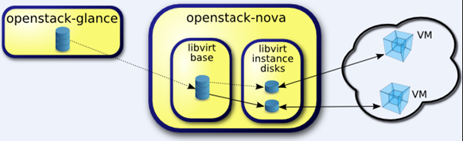

release time :2017-06-14 15:25

> nova live-migration --block-migrate

# The role of virtual machine live migration

Every reader may ask such a question, the virtual machine is used well, why should it be migrated? That is, where is the value and purpose of migration. In the daily operation and maintenance of the data center, the following scenarios and requirements are often dealt with. After understanding these requirements, this question will have an answer.
* Requirement 1: Maintenance, fault repair and upgrade of the physical machine hardware system, but the virtual machine running on this physical machine cannot be shut down, because the user's important services run on it.
* Requirement 2: The software system of the physical machine is upgraded and patched. In order not to affect the virtual machine running on it, the virtual machine needs to be migrated to another physical machine before upgrading and patching.
* Requirement 3: The load on a physical machine is too heavy, and some virtual machines need to be reduced to release resources.
* Requirement 4: In a cluster, some physical machines have too many virtual machines, and some physical machines have too few virtual machines. Resource balance needs to be done.

In addition to the above four main requirements, from a service point of view, Live migration has the following two benefits:
* Benefit 1: The maintenance and upgrade of software and hardware systems will not affect the key services of users, which improves the high availability of services and users satisfaction.
* Benefit 2: The system administrator does not need to work overtime, and upgrades the system in the middle of the night. This work can be completed during normal working hours, reducing the company's maintenance costs.

# basic concept

Before understanding live migration, you must understand the image file format QCOW2. Qcow2 is currently the image format recommended by QEMU. It supports sparse files to save storage space, supports encryption to improve the security of image files, and supports zlib-based compression. Qcow2 image can be used to save the changes of another image file, it does not modify the original image file, which is also called backing_file. Only the image file that is different from the original image file is recorded. This kind of image file is called copy-on-write image. Although it is a separate image file, most of its data comes from the original image, and only based on the original image Only the incremental part of the file will be recorded. The virtual machines mentioned in this article are all created by OpenStack using Qcow2 format image files, as shown in the figure, including two parts.
1. Back-end image (libvirt base)
2. Separate incremental image file of virtual machine (libvirt instance disks), copy-on-write image

    [root@NFJD-TESTN-COMPUTE-1 ~]# cd /var/lib/nova/instances/
    [root@NFJD-TESTN-COMPUTE-1 ~]# tree
    ├── b9530e7b-2309-4eb5-bec3-180241c1e3a2
    │   ├── console.log
    │   ├── disk
    │   ├── disk.config
    │   ├── disk.info
    │   └── libvirt.xml
    ├── ...
    ├── _base
    │   ├── 0522bc602608d45758d815b01a6899ff3e1e3e27
    │   ├── 05252f6d26980b56fbf93a14c5e70910f18b412c
    │   ├── ...

Use qemu-img to view the information of the virtual machine's separate incremental image file, we can see that his backing file is the image file in the _base directory

    [root@NFJD-TESTN-COMPUTE-1 ~]# cd /var/lib/nova/instances/
    [root@NFJD-TESTN-COMPUTE-1 instances]# cd 852e1a26-bd49-4149-bd24-552eb4b37034
    [root@NFJD-TESTN-COMPUTE-1 852e1a26-bd49-4149-bd24-552eb4b37034]# ls
    console.log  disk  disk.config  disk.info  libvirt.xml
    [root@NFJD-TESTN-COMPUTE-1 852e1a26-bd49-4149-bd24-552eb4b37034]# qemu-img info disk
    image: disk
    file format: qcow2
    virtual size: 20G (21474836480 bytes)
    disk size: 281M
    cluster_size: 65536
    backing file: /var/lib/nova/instances/_base/731d527f50917ff3364203ebbcf8d4c22dc7919c
    Format specific information:
        compat: 1.1
        lazy refcounts: false
        refcount bits: 16
        corrupt: false

After spending so much time introducing QCOW2, you may wonder, what is the purpose? In fact, the back-end image (libvirt Base) and the incremental image file (libvirt instance disks) of the virtual machine described above are the data to be migrated. The ultimate goal of live migration is to completely migrate them from the source physical host to the target physical host. In addition to the two of them, there is another object that needs to be migrated, which is the data of the virtual machine running in memory.

The transfer of data involves the transmission of data, and the transmission of data needs to go through the network. This article introduces the use of TCP network protocol to realize dynamic migration. Libvirt does not support the TCP protocol by default, you need to modify the configuration of libvirt to enable libvirt to support the TCP protocol, and the following chapters will introduce how to configure it in detail. During the migration process, the libvirtd process running in the destination physical host (Dest Host) needs to create a URI based on the address and port. The URI is used by the destination physical host to receive data and send data back to the source physical host (Source Host). libvirtd process.

On the destination physical host and the source physical host, as long as the following commands can be executed, it means that data can be transferred.

**Execute on compute01:**

    [root@compute01]# virsh -c qemu+tcp://nova@compute02/system

**Execute on compute02:**

    [root@compute01]# virsh -c qemu+tcp://nova@compute01/system

Such as:

    [root@NFJD-TESTN-COMPUTE-1 instances]# virsh -c qemu+tcp://nova@NFJD-TESTN-COMPUTE-2/system
    欢迎使用 virsh，虚拟化的交互式终端。

    输入：'help' 来获得命令的帮助信息
        'quit' 退出

    virsh # list
    Id    名称                         状态
    ----------------------------------------------------
    9     instance-000057c2              暂停
    10    instance-000057c6              running
    24    instance-0000581a              暂停
    25    instance-0000581f              running
    31    instance-00005833              running
    ...

# Migration steps

Now that the basic concept of migration is clarified, let's continue to introduce the steps of migration. A normal process of OpenStack live migration mainly includes four parts: pre-migration condition check, pre-migration preprocessing, migration, and post-migration processing.

## Condition checks before migration

For live migration to execute successfully, some conditions must be met, so some condition checks must be done before performing the migration.
1. Permission check, whether the user performing the migration has sufficient permissions to perform dynamic migration.
2. Parameter check, whether the parameters passed to the API are sufficient and correct, such as whether the block-migrate parameter is specified.
3. Check whether the target physical host exists.
4. Check whether the migrated virtual machine is running.
5. Check whether the nova-compute service on the source and destination physical hosts is running normally.
6. Check whether the destination physical host and the source physical host are the same machine.
7. Check whether the destination physical host has enough memory.
8. Check whether the hypervisor and hypervisor versions of the destination and source physical host machines are the same.

## Preprocessing before migration

Before actually performing the migration, you must do some warm-up and do some preparatory work.
1. Obtain and prepare the block device (volume) mounted by the virtual machine on the target physical host.
2. Set up the network (networks) of the virtual machine on the destination physical host.
3. Set up a virtual machine firewall (fireware) on the destination physical host.

## migrate

After the conditions are met and the preprocessing work is completed, live migration can be performed. The main steps are as follows:

1. Call the libvirt python interface migrateToURI to migrate the source host to the destination host.
* dom.migrateToURI(CONF.live_migration_uri % dest,logical_sum,None,CONF.live_migration_bandwidth)
* live_migration_uri: This URI is defined by the libvirtd process introduced in 3.2.2.
* live_migration_bandwidth: This parameter defines the maximum bandwidth used during the migration.
2. Call the wait_for_live_migration method cyclically at a certain time interval (0.5) to detect the status of the virtual machine migration until the virtual machine is successfully migrated.

## Post-migration processing

After the virtual machine migration is complete, some aftermath work needs to be done.
1. Detach volume on the source physical host.
2. Release the security group ingress rule on the source physical host.
3. Update the status of the virtual machine in the database on the destination physical host.
4. Delete the virtual machine on the source physical host.

After the above four steps are completed normally, the virtual machine is successfully migrated from the source physical host to the destination physical host. The system administrator can then perform the administrative tasks listed in Chapter 2.

# Configuration for Live Migration

This section lists the configurations that support live migration. You must ensure that the configurations on all physical hosts are correct before live migration can be successfully completed.

## libvirt

By default, libvirt supports the TLS protocol for remote connections, but does not support the TCP protocol, so listen_tls=0 listen_tcp=1 enables libvirt to support the TCP protocol.

1. Modify the /etc/sysconfig/libvirtd file.

    LIBVIRTD_ARGS="--listen"

2. Do the following configuration in the /etc/libvirt/libvirtd.conf file.

    listen_tls=0
    listen_tcp=1
    auth_tcp="none"

3. Restart the libvirtd service

## firewall

Configure /etc/sysconfig/iptables to open TCP port 16509.

    -A INPUT -p tcp -m multiport --ports 16509 -m comment --comment "libvirt" -j ACCEPT

## OpenStack Nova

Configure the live_migration flag in the /etc/nova/nova.conf file.

    live_migration_flag=VIR_MIGRATE_UNDEFINE_SOURCE,VIR_MIGRATE_PEER2PEER,VIR_MIGRATE_LIVE