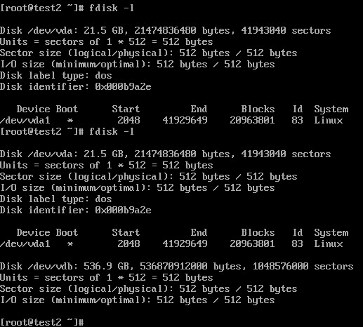
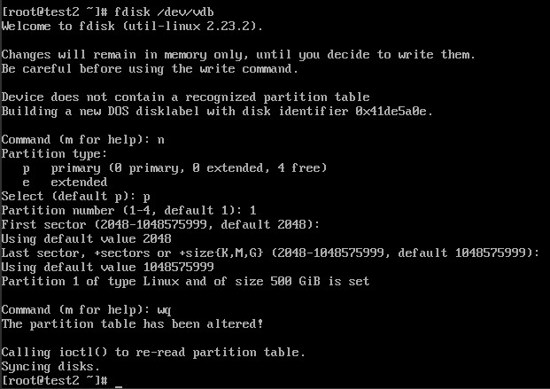
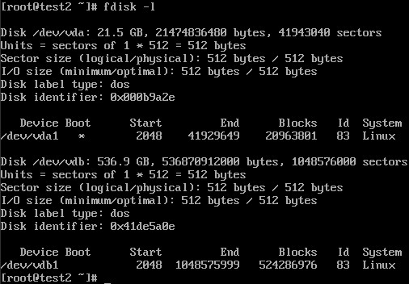
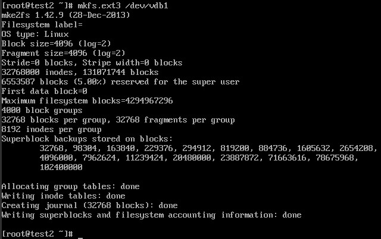
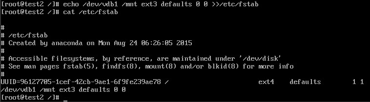
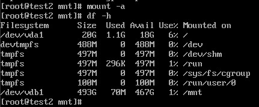
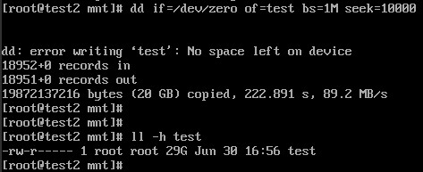

release time :2017-06-30 05:16

# Create (order) a cloud disk

    [root@NFJD-PSC-BCEC-SV3 deployer]# cinder create 500 --volume-type fujitsu-ipsan --name 0630
    +---------------------------------------+--------------------------------------+
    |                Property               |                Value                 |
    +---------------------------------------+--------------------------------------+
    |              attachments              |                  []                  |
    |           availability_zone           |                 nova                 |
    |                bootable               |                false                 |
    |          consistencygroup_id          |                 None                 |
    |               created_at              |      2017-06-30T08:23:05.000000      |
    |              description              |                 None                 |
    |               encrypted               |                False                 |
    |                   id                  | 08d3018c-b1cd-4652-87ed-45a48a14b6f3 |
    |                metadata               |                  {}                  |
    |              multiattach              |                False                 |
    |                  name                 |                 0630                 |
    |      os-vol-tenant-attr:tenant_id     |   597854e23bfe46abb6178f786af12391   |
    |   os-volume-replication:driver_data   |                 None                 |
    | os-volume-replication:extended_status |                 None                 |
    |           replication_status          |               disabled               |
    |                  size                 |                 500                  |
    |              snapshot_id              |                 None                 |
    |              source_volid             |                 None                 |
    |                 status                |               creating               |
    |                user_id                |   622684c00210427091c7493f36aaa6cf   |
    |              volume_type              |            fujitsu-ipsan             |
    +---------------------------------------+--------------------------------------+

# Mount cloud disk

Existing cloud host id 27b31829-326f-4029-a537-bb327303a32c

Mount the cloud disk to the cloud host

    [root@NFJD-PSC-BCEC-SV3 deployer]# nova volume-attach 27b31829-326f-4029-a537-bb327303a32c 08d3018c-b1cd-4652-87ed-45a48a14b6f3
    +----------+--------------------------------------+
    | Property | Value                                |
    +----------+--------------------------------------+
    | device   | /dev/vdb                             |
    | id       | 08d3018c-b1cd-4652-87ed-45a48a14b6f3 |
    | serverId | 27b31829-326f-4029-a537-bb327303a32c |
    | volumeId | 08d3018c-b1cd-4652-87ed-45a48a14b6f3 |
    +----------+--------------------------------------+

Comparing the execution results of the fdisk -l command before and after mounting, it is found that after the cloud disk is mounted, there is an extra vdb

# artition

Run fdisk /dev/vdb to partition the data disk. According to the prompt, enter n, p, 1 in sequence, press Enter twice, wq, and the partition starts.

Run the fdisk -l command to view the new partition. The new partition vdb1 has been created. Like /dev/xvdb in the example below.

# format

Run mkfs.ext3 /dev/xvdb1 to format the new partition. The time required for formatting depends on the size of the data disk. You can also decide to choose other file formats, such as ext4, etc.

Run echo /dev/xvdb1 /mnt ext3 defaults 0 0 >> /etc/fstab to write new partition information. Once complete, you can use the cat /etc/fstab command to view.

Through the command mount -a, after modifying /etc/fstab, it will take effect without restarting. Then execute df -h to view the partitions. If the data disk information appears, it means that the mount is successful and the new partition can be used.

# Linux uses the dd command to quickly generate large files

The dd command can easily create a file of a specified size, such as

    dd if=/dev/zero of=test bs=1M count=1000

A 1000M test file will be generated, and the content of the file is all 0 (because it is read from /dev/zero, /dev/zero is the source of 0)

But this is for actually writing to the hard disk. The speed of file generation depends on the read and write speed of the hard disk. If you want to generate very large files, the speed is very slow.

In a certain scenario, we just want the file system to think that there is a very large file here, but we don’t actually write it to the hard disk

then you can

    dd if=/dev/zero of=test bs=1M count=0 seek=100000

The displayed size of the file created at this time in the file system is 100000MB, but it does not actually occupy a block, so the creation speed is comparable to the memory speed

The function of seek is to skip the part of the specified size in the output file, which achieves the purpose of creating a large file, but not actually writing

> Of course, because you don’t actually write to the hard disk, you can create 100G of such files on a hard disk with a capacity of only 10G.