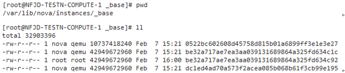
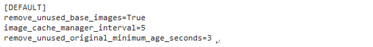
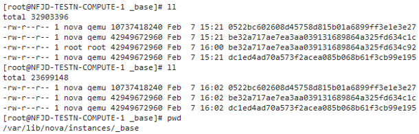

release time :2020-01-01 19:13

# Automatically clear mirror cache

Create a virtual machine on a computing node. If you create a secondary virtual machine on this node for the first time, the image file will be copied to the computing node directory /var/lib/nova/instances/_base. In the long run, this directory will take up relatively large disk space and needs to be cleaned up.

The cache directory can be automatically cleaned up by modifying the nova configuration file.

Compare the difference before and after setting remove_unused_base_images=True, that is, redundant images will not be automatically cleared before setting, but after setting and restarting the nova-compute service, redundant image files will be automatically cleared, and cloud hosts can be generated normally.

**remove_unused_base_images=True before setting:**

be32a717ae7ea3aa039131689864a325fd634c92 is an unused image file.

After waiting for a while, the file did not change.

**remove_unused_base_images=True After setting and restarting the nova-compute service:**

image_cache_manager_interval=5, remove_unused_original_minimum_age_seconds=3 are settings to shorten the test time. The actual production environment uses the default value of 40 minutes and the set value of 24 7 hours. Now it is changed to 5 seconds and 3 seconds. That is to say, without this setting to shorten the test time, the production environment is to check the image cache in 40 minutes, and the useless base image will be deleted after 247 hours.

automatically deleted soon.
Check /var/log/nova/nova-compute.log, and also find the log that automatically deletes redundant mirrors:

    2017-02-07 16:01:51.678 14200 INFO nova.virt.libvirt.imagecache [req-ee1a7ad5-a021-4aad-b653-7db14191536e - - - - -] Active base files: /var/lib/nova/instances/_base/0522bc602608d45758d815b01a6899ff3e1e3e27 /var/lib/nova/instances/_base/dc1ed4ad70a573f2acea085b068b61f3cb99e195 /var/lib/nova/instances/_base/be32a717ae7ea3aa039131689864a325fd634c1c
    2017-02-07 16:01:51.678 14200 INFO nova.virt.libvirt.imagecache [req-ee1a7ad5-a021-4aad-b653-7db14191536e - - - - -] Removable base files: /var/lib/nova/instances/_base/be32a717ae7ea3aa039131689864a325fd634c92
    2017-02-07 16:01:51.679 14200 INFO nova.virt.libvirt.imagecache [req-ee1a7ad5-a021-4aad-b653-7db14191536e - - - - -] Removing base or swap file: /var/lib/nova/instances/_base/be32a717ae7ea3aa039131689864a325fd634c92

Dashboard neutron reports error Invalid service catalog service: network

**Phenomenon:**
The neutron service is good, and the command line creates a network to view the network normally, but the dashboard cannot view the network-related pages. The
dashboard neutron reports an error Invalid service catalog service: network

**Solution:**
It should be that Keystone is not properly configured. As a result, no relevant Catalog information was found.

    [root@EXTENV-194-18-2-11 ~]# openstack catalog list
    +-----------+-----------+-----------------------------------------------+
    | Name      | Type      | Endpoints                                     |
    +-----------+-----------+-----------------------------------------------+
    | placement | placement | RegionOne                                     |
    |           |           |   internal: http://nova-ha-vip:8778           |
    |           |           | RegionOne                                     |
    |           |           |   admin: http://nova-ha-vip:8778              |
    |           |           | RegionOne                                     |
    |           |           |   public: http://nova-ha-vip:8778             |
    |           |           |                                               |
    | keystone  | identity  | RegionOne                                     |
    |           |           |   public: http://keystone-ha-vip:5000/v3/     |
    |           |           | RegionOne                                     |
    |           |           |   internal: http://keystone-ha-vip:35357/v3/  |
    |           |           | RegionOne                                     |
    |           |           |   admin: http://keystone-ha-vip:35357/v3/     |
    |           |           |                                               |
    | glance    | image     | RegionOne                                     |
    |           |           |   admin: http://glance-ha-vip:9292            |
    |           |           | RegionOne                                     |
    |           |           |   internal: http://glance-ha-vip:9292         |
    |           |           | RegionOne                                     |
    |           |           |   public: http://glance-ha-vip:9292           |
    |           |           |                                               |
    | nova      | compute   | RegionOne                                     |
    |           |           |   public: http://nova-ha-vip:8774/v2.1        |
    |           |           | RegionOne                                     |
    |           |           |   admin: http://nova-ha-vip:8774/v2.1         |
    |           |           | RegionOne                                     |
    |           |           |   internal: http://nova-ha-vip:8774/v2.1      |
    |           |           |                                               |
    | neutron   | network   |                                               |
    | neutron   | network   | RegionOne                                     |
    |           |           |   public: http://neutron-server-ha-vip:9696   |
    |           |           | RegionOne                                     |
    |           |           |   admin: http://neutron-server-ha-vip:9696    |
    |           |           | RegionOne                                     |
    |           |           |   internal: http://neutron-server-ha-vip:9696 |
    |           |           |                                               |
    +-----------+-----------+-----------------------------------------------+

So just delete the first neutron data without url, but found that there is only openstack catalog list, no openstack catalog delete command. Later, I checked the keystone configuration file keystone.conf and found the following configuration.

from the configuration file. The catalog is the data read from mysql, and then the dirty data is found from the service table in the keystone library of mysql, and then I know to use openstack service delete to delete the 'dirty data', and the problem is solved.

    MariaDB [keystone]> select * from service;
    +----------------------------------+-----------+---------+-------------------------------------------------------------+
    | id                               | type      | enabled | extra                                                       |
    +----------------------------------+-----------+---------+-------------------------------------------------------------+
    | 520f6bf8564240be9678c4ef25305cad | placement |       1 | {"description": "OpenStack Placement", "name": "placement"} |
    | 960580852a594c078e68fe3683e35db5 | identity  |       1 | {"name": "keystone"}                                        |
    | 98ed18fcd8104732919bb5869a5a6dc2 | image     |       1 | {"description": "OpenStack Image", "name": "glance"}        |
    | abef1b9469d94d3ab9f27c8ed72a5a48 | compute   |       1 | {"description": "OpenStack Compute", "name": "nova"}        |
    | e37085e8fb2a49c0921c2d24f5e4f9b5 | network   |       1 | {"description": "OpenStack Networking", "name": "neutron"}  |
    | f1b661407ce04f79bc24605fa59bb74c | network   |       1 | {"description": "OpenStack Networking", "name": "neutron"}  |
    +----------------------------------+-----------+---------+-------------------------------------------------------------+
    6 rows in set (0.00 sec)

    MariaDB [keystone]> select * from endpoint;
    +----------------------------------+--------------------+-----------+----------------------------------+-----------------------------------+-------+---------+-----------+
    | id                               | legacy_endpoint_id | interface | service_id                       | url                               | extra | enabled | region_id |
    +----------------------------------+--------------------+-----------+----------------------------------+-----------------------------------+-------+---------+-----------+
    | 142cb619cd2242828b0c9394d5baaea1 | NULL               | public    | f1b661407ce04f79bc24605fa59bb74c | http://neutron-server-ha-vip:9696 | {}    |       1 | RegionOne |
    | 2252d3ef840b4c5aa1184ebe8d6094f1 | NULL               | public    | abef1b9469d94d3ab9f27c8ed72a5a48 | http://nova-ha-vip:8774/v2.1      | {}    |       1 | RegionOne |
    | 476654c6e7dd4d22b290de451e3afda0 | NULL               | admin     | abef1b9469d94d3ab9f27c8ed72a5a48 | http://nova-ha-vip:8774/v2.1      | {}    |       1 | RegionOne |
    | 562a5d5443af4dfab6760204d0adf3bf | NULL               | internal  | 520f6bf8564240be9678c4ef25305cad | http://nova-ha-vip:8778           | {}    |       1 | RegionOne |
    | 58bd5f09811a4ebcb62a4b51fb7ae444 | NULL               | admin     | f1b661407ce04f79bc24605fa59bb74c | http://neutron-server-ha-vip:9696 | {}    |       1 | RegionOne |
    | 600811f8ccaf42669d4d83b897af3933 | NULL               | admin     | 520f6bf8564240be9678c4ef25305cad | http://nova-ha-vip:8778           | {}    |       1 | RegionOne |
    | 80683f619efb41dcbb6796ea04f16159 | NULL               | internal  | f1b661407ce04f79bc24605fa59bb74c | http://neutron-server-ha-vip:9696 | {}    |       1 | RegionOne |
    | 8e0a684607294a729f87d7d8b1a639ca | NULL               | public    | 520f6bf8564240be9678c4ef25305cad | http://nova-ha-vip:8778           | {}    |       1 | RegionOne |
    | 9ef0f18d891e45608ffc41985dc6afa6 | NULL               | public    | 960580852a594c078e68fe3683e35db5 | http://keystone-ha-vip:5000/v3/   | {}    |       1 | RegionOne |
    | a0b10cb04a5b4ca3859aaf2ea4ca2a3b | NULL               | admin     | 98ed18fcd8104732919bb5869a5a6dc2 | http://glance-ha-vip:9292         | {}    |       1 | RegionOne |
    | c53979becccc44f1813e9f50a619af7e | NULL               | internal  | 960580852a594c078e68fe3683e35db5 | http://keystone-ha-vip:35357/v3/  | {}    |       1 | RegionOne |
    | dadbb8dc218245bbba8c9a34237413ec | NULL               | internal  | 98ed18fcd8104732919bb5869a5a6dc2 | http://glance-ha-vip:9292         | {}    |       1 | RegionOne |
    | f4034b8c086a451caed52ac51a761fb0 | NULL               | public    | 98ed18fcd8104732919bb5869a5a6dc2 | http://glance-ha-vip:9292         | {}    |       1 | RegionOne |
    | fc150884825544baaf4912f14e76f51a | NULL               | internal  | abef1b9469d94d3ab9f27c8ed72a5a48 | http://nova-ha-vip:8774/v2.1      | {}    |       1 | RegionOne |
    | fc7132052063438895674fd7b840db68 | NULL               | admin     | 960580852a594c078e68fe3683e35db5 | http://keystone-ha-vip:35357/v3/  | {}    |       1 | RegionOne |
    +----------------------------------+--------------------+-----------+----------------------------------+-----------------------------------+-------+---------+-----------+
    15 rows in set (0.00 sec)

    [root@EXTENV-194-18-2-11 ~]#  openstack service list
    +----------------------------------+-----------+-----------+
    | ID                               | Name      | Type      |
    +----------------------------------+-----------+-----------+
    | 520f6bf8564240be9678c4ef25305cad | placement | placement |
    | 960580852a594c078e68fe3683e35db5 | keystone  | identity  |
    | 98ed18fcd8104732919bb5869a5a6dc2 | glance    | image     |
    | abef1b9469d94d3ab9f27c8ed72a5a48 | nova      | compute   |
    | e37085e8fb2a49c0921c2d24f5e4f9b5 | neutron   | network   |
    | f1b661407ce04f79bc24605fa59bb74c | neutron   | network   |
    +----------------------------------+-----------+-----------+
    [root@EXTENV-194-18-2-11 ~]# openstack service delete e37085e8fb2a49c0921c2d24f5e4f9b5
    [root@EXTENV-194-18-2-11 ~]# systemctl restart httpd.service memcached.service
