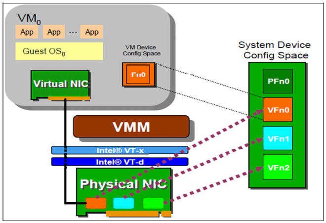

release time :2018-10-14 05:15

# SR-IOV function introduction

SR-IOV enables a single functional unit (for example, an Ethernet port) to look like multiple independent physical devices, that is, a physical device supporting the SR-IOV function can be configured as multiple functional units.

SR-IOV has two functions:

Physical Functions (PF): This is a complete PCIe device with SR-IOV capability. PFs can be discovered, managed and configured like normal PCI devices.
Virtual Functions (VF): Simple PCIe functions that can only handle I/O. Each VF is separated from the PF. Each physical hardware has a limit on the number of VFs. A PF can be virtualized into multiple VFs for allocation to multiple virtual machines.
Hypervisor can assign one or more VFs to a virtual machine. At a certain time, a VF can only be assigned to a virtual machine. A virtual machine can have multiple VFs. From the perspective of the operating system of the virtual machine, a VF network card looks the same as a normal network card. The SR-IOV driver is implemented in the kernel.
Example of NIC SR-IOV:

# Virtualize the PF of the sriov computing node into multiple VFs

The sriov computing node selects optical port 1 (eg enp5s0f1) as the sriov network card
1. On the computing node, set the BIOS to support VT-d for Intel, which can be verified by cat /proc/cpuinfo | grep vmx
2. Configure the /etc/default/grub file of the computing node, add intel_iommu=on to GRUB_CMDLINE_LINUX to activate the VT-d function, and restart the physical machine (intel 82599 series network card is used in this environment)

    $ cat /etc/default/grub
    GRUB_TIMEOUT=5
    GRUB_DISTRIBUTOR="$(sed 's, release .*$,,g' /etc/system-release)"
    GRUB_DEFAULT=saved
    GRUB_DISABLE_SUBMENU=true
    GRUB_TERMINAL_OUTPUT="console"
    GRUB_CMDLINE_LINUX="crashkernel=auto rd.lvm.lv=bclinux/root rd.lvm.lv=bclinux/swap intel_iommu=on rhgb quiet"
    GRUB_DISABLE_RECOVERY="true"

    $ grub2-mkconfig --output=/boot/grub2/grub.cfg
    $ reboot

3. In this environment, the 82599 network card supports a maximum of 64 vfs. It is planned to virtualize 16 vfs on each sriov computing node for use. The command is as follows:

    # echo '16' > /sys/class/net/enp5s0f1/device/sriov_numvfs
    # lspci | grep Ethernet

    05:00.0 Ethernet controller [0200]: Intel Corporation 82599ES 10-Gigabit SFI/SFP+ Network Connection [8086:10fb] (rev 01)
    05:00.1 Ethernet controller [0200]: Intel Corporation 82599ES 10-Gigabit SFI/SFP+ Network Connection [8086:10fb] (rev 01)
    05:10.1 Ethernet controller [0200]: Intel Corporation 82599 Ethernet Controller Virtual Function [8086:10ed] (rev 01)
    05:10.3 Ethernet controller [0200]: Intel Corporation 82599 Ethernet Controller Virtual Function [8086:10ed] (rev 01)
    05:10.5 Ethernet controller [0200]: Intel Corporation 82599 Ethernet Controller Virtual Function [8086:10ed] (rev 01)
    05:10.7 Ethernet controller [0200]: Intel Corporation 82599 Ethernet Controller Virtual Function [8086:10ed] (rev 01)
    05:11.1 Ethernet controller [0200]: Intel Corporation 82599 Ethernet Controller Virtual Function [8086:10ed] (rev 01)
    05:11.3 Ethernet controller [0200]: Intel Corporation 82599 Ethernet Controller Virtual Function [8086:10ed] (rev 01)
    05:11.5 Ethernet controller [0200]: Intel Corporation 82599 Ethernet Controller Virtual Function [8086:10ed] (rev 01)
    05:11.7 Ethernet controller [0200]: Intel Corporation 82599 Ethernet Controller Virtual Function [8086:10ed] (rev 01)
    05:12.1 Ethernet controller [0200]: Intel Corporation 82599 Ethernet Controller Virtual Function [8086:10ed] (rev 01)
    05:12.3 Ethernet controller [0200]: Intel Corporation 82599 Ethernet Controller Virtual Function [8086:10ed] (rev 01)
    05:12.5 Ethernet controller [0200]: Intel Corporation 82599 Ethernet Controller Virtual Function [8086:10ed] (rev 01)
    05:12.7 Ethernet controller [0200]: Intel Corporation 82599 Ethernet Controller Virtual Function [8086:10ed] (rev 01)
    05:13.1 Ethernet controller [0200]: Intel Corporation 82599 Ethernet Controller Virtual Function [8086:10ed] (rev 01)
    05:13.3 Ethernet controller [0200]: Intel Corporation 82599 Ethernet Controller Virtual Function [8086:10ed] (rev 01)
    05:13.5 Ethernet controller [0200]: Intel Corporation 82599 Ethernet Controller Virtual Function [8086:10ed] (rev 01)
    05:13.7 Ethernet controller [0200]: Intel Corporation 82599 Ethernet Controller Virtual Function [8086:10ed] (rev 01)
    08:00.0 Ethernet controller [0200]: Intel Corporation I350 Gigabit Network Connection [8086:1521] (rev 01)
    08:00.1 Ethernet controller [0200]: Intel Corporation I350 Gigabit Network Connection [8086:1521] (rev 01)

    # ip link show enp5s0f1

    5: enp5s0f1: <BROADCAST,MULTICAST,UP,LOWER_UP> mtu 1500 qdisc mq state UP mode DEFAULT qlen 1000
        link/ether 6c:92:bf:04:66:01 brd ff:ff:ff:ff:ff:ff
        vf 0 MAC 00:00:00:00:00:00, spoof checking on, link-state auto, trust off, query_rss off
        vf 1 MAC 00:00:00:00:00:00, spoof checking on, link-state auto, trust off, query_rss off
        vf 2 MAC 00:00:00:00:00:00, spoof checking on, link-state auto, trust off, query_rss off
        vf 3 MAC 00:00:00:00:00:00, spoof checking on, link-state auto, trust off, query_rss off
        vf 4 MAC 00:00:00:00:00:00, spoof checking on, link-state auto, trust off, query_rss off
        vf 5 MAC 00:00:00:00:00:00, spoof checking on, link-state auto, trust off, query_rss off
        vf 6 MAC 00:00:00:00:00:00, spoof checking on, link-state auto, trust off, query_rss off
        vf 7 MAC 00:00:00:00:00:00, spoof checking on, link-state auto, trust off, query_rss off
        vf 8 MAC 00:00:00:00:00:00, spoof checking on, link-state auto, trust off, query_rss off
        vf 9 MAC 00:00:00:00:00:00, spoof checking on, link-state auto, trust off, query_rss off
        vf 10 MAC 00:00:00:00:00:00, spoof checking on, link-state auto, trust off, query_rss off
        vf 11 MAC 00:00:00:00:00:00, spoof checking on, link-state auto, trust off, query_rss off
        vf 12 MAC 00:00:00:00:00:00, spoof checking on, link-state auto, trust off, query_rss off
        vf 13 MAC 00:00:00:00:00:00, spoof checking on, link-state auto, trust off, query_rss off
        vf 14 MAC 00:00:00:00:00:00, spoof checking on, link-state auto, trust off, query_rss off
        vf 15 MAC 00:00:00:00:00:00, spoof checking on, link-state auto, trust off, query_rss off

4. To ensure that vfs still exists after restarting, you need to write the command to set the number of vfs into /etc/rc.local, the command is as follows

    # echo "echo '16' > /sys/class/net/enp5s0f1/device/sriov_numvfs" >> /etc/rc.local
    # chmod +x /etc/rc.local /etc/rc.d/rc.local

5. Modify the nova.conf file of the control node to allow nova-schedule to support pci passthrough filtering

    # vim /etc/nova/nova.conf
    enable_filters = RetryFilter, AvailabilityZoneFilter, RamFilter, ComputeFilter, ComputeCapabilitiesFilter, ImagePropertiesFilter, ServerGroupAntiAffinityFilter, ServerGroupAffinityFilter, PciPassthroughFilter
    available_filters = nova.scheduler.filters.all_filters

    # systemctl restart openstack-nova-scheduler

# Configure SRIOV virtual machine computing nodes

1. Install neutron-sriov-agent

    # yum install openstack-neutron-sriov-nic-agent openstack-neutron

2. Configure neutron.conf

to copy the control node neutron.conf configuration and modify the corresponding parameters, mainly to modify the local management network ip parameters

3. Configure sriov_agent.ini

    # vim /etc/neutron/plugins/ml2/sriov_agent.ini

    [securitygroup]
    firewall_driver = neutron.agent.firewall.NoopFirewallDriver

    [sriov_nic]
    physical_device_mappings = default: enp5s0f1
    exclude_devices =

4. Start the neutron-sriov-agent service

    # systemctl enable neutron-sriov-nic-agent
    # systemctl start neutron-sriov-nic-agent

5. Modify the nova.conf file of the node and restart nova-compute

    # vim /etc/nova/nova.conf
    passthrough_whitelist = {"devname": "enp5s0f1", "physical_network": "physnet1"}

    # systemctl restart openstack-nova-compute

If you need to configure multiple SRIOV network cards

    [root@controller ~]# vim /etc/nova/nova.conf
    [pci]
    passthrough_whitelist = {"devname": "enp129s0f0", "physical_network": "physnet1"}
    passthrough_whitelist = {"devname": "enp130s0f0", "physical_network": "physnet1"}
    [root@SRIOV03 ~]# vim /etc/neutron/plugins/ml2/sriov_agent.ini 
    [sriov_nic]
    physical_device_mappings = physnet1:enp129s0f0,physnet1:enp130s0f0

# Test srivo non-affinity functions

That is: set the two vnics of the vm in the same non-affinity group, and the two vnics of the generated sriov virtual machine will be distributed on two different physical SRIOV network cards

    [root@controller ~]# openstack port create --vnic-type direct --binding-profile anti_affinity_group=gwgh729 --network 40fa3655-1dc6-4fa1-8a21-507ae2a92cc5 sriov-port-1
    +-----------------------+-----------------------------------------------------------------------------+
    | Field                 | Value                                                                       |
    +-----------------------+-----------------------------------------------------------------------------+
    | admin_state_up        | UP                                                                          |
    | allowed_address_pairs |                                                                             |
    | binding_host_id       |                                                                             |
    | binding_profile       | anti_affinity_group='gwgh729'                                               |
    | binding_vif_details   |                                                                             |
    | binding_vif_type      | unbound                                                                     |
    | binding_vnic_type     | direct                                                                      |
    | created_at            | 2018-10-11T07:11:06Z                                                        |
    | data_plane_status     | None                                                                        |
    | description           |                                                                             |
    | device_id             |                                                                             |
    | device_owner          |                                                                             |
    | dns_assignment        | None                                                                        |
    | dns_name              | None                                                                        |
    | extra_dhcp_opts       |                                                                             |
    | fixed_ips             | ip_address='192.168.5.48', subnet_id='8e026845-10d0-486b-9e34-45f2f2f01ada' |
    | id                    | cb96ed5a-9bbc-46f7-9a44-fdc45e11b25b                                        |
    | ip_address            | None                                                                        |
    | mac_address           | fa:16:3e:c8:f7:9f                                                           |
    | name                  | sriov-port-1                                                                |
    | network_id            | 40fa3655-1dc6-4fa1-8a21-507ae2a92cc5                                        |
    | option_name           | None                                                                        |
    | option_value          | None                                                                        |
    | port_security_enabled | True                                                                        |
    | project_id            | 39db8ee1aced4109aa7ea45c9b45aa97                                            |
    | qos_policy_id         | None                                                                        |
    | revision_number       | 3                                                                           |
    | security_group_ids    | 46a06d50-4ed7-495f-9458-eab6843495a8                                        |
    | status                | DOWN                                                                        |
    | subnet_id             | None                                                                        |
    | tags                  |                                                                             |
    | trunk_details         | None                                                                        |
    | updated_at            | 2018-10-11T07:11:07Z                                                        |
    +-----------------------+-----------------------------------------------------------------------------+
    [root@controller ~]# openstack port create --vnic-type direct --binding-profile anti_affinity_group=gwgh729 --network 40fa3655-1dc6-4fa1-8a21-507ae2a92cc5 sriov-port-2
    +-----------------------+-----------------------------------------------------------------------------+
    | Field                 | Value                                                                       |
    +-----------------------+-----------------------------------------------------------------------------+
    | admin_state_up        | UP                                                                          |
    | allowed_address_pairs |                                                                             |
    | binding_host_id       |                                                                             |
    | binding_profile       | anti_affinity_group='gwgh729'                                               |
    | binding_vif_details   |                                                                             |
    | binding_vif_type      | unbound                                                                     |
    | binding_vnic_type     | direct                                                                      |
    | created_at            | 2018-10-11T07:11:17Z                                                        |
    | data_plane_status     | None                                                                        |
    | description           |                                                                             |
    | device_id             |                                                                             |
    | device_owner          |                                                                             |
    | dns_assignment        | None                                                                        |
    | dns_name              | None                                                                        |
    | extra_dhcp_opts       |                                                                             |
    | fixed_ips             | ip_address='192.168.5.60', subnet_id='8e026845-10d0-486b-9e34-45f2f2f01ada' |
    | id                    | d8ae3337-b98a-4523-9665-ed7773c6da90                                        |
    | ip_address            | None                                                                        |
    | mac_address           | fa:16:3e:23:0e:45                                                           |
    | name                  | sriov-port-2                                                                |
    | network_id            | 40fa3655-1dc6-4fa1-8a21-507ae2a92cc5                                        |
    | option_name           | None                                                                        |
    | option_value          | None                                                                        |
    | port_security_enabled | True                                                                        |
    | project_id            | 39db8ee1aced4109aa7ea45c9b45aa97                                            |
    | qos_policy_id         | None                                                                        |
    | revision_number       | 3                                                                           |
    | security_group_ids    | 46a06d50-4ed7-495f-9458-eab6843495a8                                        |
    | status                | DOWN                                                                        |
    | subnet_id             | None                                                                        |
    | tags                  |                                                                             |
    | trunk_details         | None                                                                        |
    | updated_at            | 2018-10-11T07:11:17Z                                                        |
    +-----------------------+-----------------------------------------------------------------------------+
    [root@controller ~]# nova boot han-sriov-antiaffinity --image 4ce53c0e-b3f5-4463-bdcd-20ee0f74fec6 --flavor 071b6288-8087-4d2e-959a-0b3bbb7fc565 --nic port-id=cb96ed5a-9bbc-46f7-9a44-fdc45e11b25b --nic port-id=d8ae3337-b98a-4523-9665-ed7773c6da90 --availability-zone sriov:SRIOV03
    +--------------------------------------+------------------------------------------------------+
    | Property                             | Value                                                |
    +--------------------------------------+------------------------------------------------------+
    | OS-DCF:diskConfig                    | MANUAL                                               |
    | OS-EXT-AZ:availability_zone          | sriov                                                |
    | OS-EXT-SRV-ATTR:host                 | -                                                    |
    | OS-EXT-SRV-ATTR:hostname             | han-sriov-antiaffinity                               |
    | OS-EXT-SRV-ATTR:hypervisor_hostname  | -                                                    |
    | OS-EXT-SRV-ATTR:instance_name        |                                                      |
    | OS-EXT-SRV-ATTR:kernel_id            |                                                      |
    | OS-EXT-SRV-ATTR:launch_index         | 0                                                    |
    | OS-EXT-SRV-ATTR:ramdisk_id           |                                                      |
    | OS-EXT-SRV-ATTR:reservation_id       | r-3vjlmls4                                           |
    | OS-EXT-SRV-ATTR:root_device_name     | -                                                    |
    | OS-EXT-SRV-ATTR:user_data            | -                                                    |
    | OS-EXT-STS:power_state               | 0                                                    |
    | OS-EXT-STS:task_state                | scheduling                                           |
    | OS-EXT-STS:vm_state                  | building                                             |
    | OS-SRV-USG:launched_at               | -                                                    |
    | OS-SRV-USG:terminated_at             | -                                                    |
    | accessIPv4                           |                                                      |
    | accessIPv6                           |                                                      |
    | adminPass                            | Z255abC53sLN                                         |
    | config_drive                         |                                                      |
    | created                              | 2018-10-11T07:12:43Z                                 |
    | description                          | -                                                    |
    | flavor:disk                          | 10                                                   |
    | flavor:ephemeral                     | 0                                                    |
    | flavor:extra_specs                   | {}                                                   |
    | flavor:original_name                 | 2u4g10g                                              |
    | flavor:ram                           | 4096                                                 |
    | flavor:swap                          | 0                                                    |
    | flavor:vcpus                         | 2                                                    |
    | hostId                               |                                                      |
    | host_status                          |                                                      |
    | id                                   | ea80e14b-2b9a-4a31-ad27-94366fa600bf                 |
    | image                                | centos7-10-08 (4ce53c0e-b3f5-4463-bdcd-20ee0f74fec6) |
    | key_name                             | -                                                    |
    | locked                               | False                                                |
    | metadata                             | {}                                                   |
    | name                                 | han-sriov-antiaffinity                               |
    | os-extended-volumes:volumes_attached | []                                                   |
    | progress                             | 0                                                    |
    | security_groups                      | default                                              |
    | status                               | BUILD                                                |
    | tags                                 | []                                                   |
    | tenant_id                            | 39db8ee1aced4109aa7ea45c9b45aa97                     |
    | updated                              | 2018-10-11T07:12:43Z                                 |
    | user_id                              | f6b12716402343e6beacdaa265e4e6c5                     |
    +--------------------------------------+------------------------------------------------------+
    [root@controller ~]# nova show han-sriov-antiaffinity
    +--------------------------------------+----------------------------------------------------------+
    | Property                             | Value                                                    |
    +--------------------------------------+----------------------------------------------------------+
    | OS-DCF:diskConfig                    | MANUAL                                                   |
    | OS-EXT-AZ:availability_zone          | sriov                                                    |
    | OS-EXT-SRV-ATTR:host                 | SRIOV03                                                  |
    | OS-EXT-SRV-ATTR:hostname             | han-sriov-antiaffinity                                   |
    | OS-EXT-SRV-ATTR:hypervisor_hostname  | SRIOV03                                                  |
    | OS-EXT-SRV-ATTR:instance_name        | instance-00000cfd                                        |
    | OS-EXT-SRV-ATTR:kernel_id            |                                                          |
    | OS-EXT-SRV-ATTR:launch_index         | 0                                                        |
    | OS-EXT-SRV-ATTR:ramdisk_id           |                                                          |
    | OS-EXT-SRV-ATTR:reservation_id       | r-3vjlmls4                                               |
    | OS-EXT-SRV-ATTR:root_device_name     | /dev/vda                                                 |
    | OS-EXT-SRV-ATTR:user_data            | -                                                        |
    | OS-EXT-STS:power_state               | 1                                                        |
    | OS-EXT-STS:task_state                | -                                                        |
    | OS-EXT-STS:vm_state                  | active                                                   |
    | OS-SRV-USG:launched_at               | 2018-10-11T07:14:49.000000                               |
    | OS-SRV-USG:terminated_at             | -                                                        |
    | accessIPv4                           |                                                          |
    | accessIPv6                           |                                                          |
    | config_drive                         |                                                          |
    | created                              | 2018-10-11T07:12:42Z                                     |
    | description                          | -                                                        |
    | flavor:disk                          | 10                                                       |
    | flavor:ephemeral                     | 0                                                        |
    | flavor:extra_specs                   | {}                                                       |
    | flavor:original_name                 | 2u4g10g                                                  |
    | flavor:ram                           | 4096                                                     |
    | flavor:swap                          | 0                                                        |
    | flavor:vcpus                         | 2                                                        |
    | hostId                               | c9ae967a850ab4bf64f157ac3c05ef0adb86743d3a1f86115cda7f04 |
    | host_status                          | UP                                                       |
    | id                                   | ea80e14b-2b9a-4a31-ad27-94366fa600bf                     |
    | image                                | centos7-10-08 (4ce53c0e-b3f5-4463-bdcd-20ee0f74fec6)     |
    | key_name                             | -                                                        |
    | locked                               | False                                                    |
    | metadata                             | {}                                                       |
    | name                                 | han-sriov-antiaffinity                                   |
    | os-extended-volumes:volumes_attached | []                                                       |
    | progress                             | 0                                                        |
    | security_groups                      | default                                                  |
    | status                               | ACTIVE                                                   |
    | tags                                 | []                                                       |
    | tenant_id                            | 39db8ee1aced4109aa7ea45c9b45aa97                         |
    | updated                              | 2018-10-11T07:13:37Z                                     |
    | user_id                              | f6b12716402343e6beacdaa265e4e6c5                         |
    | vlan811-common network               | 192.168.5.48, 192.168.5.60                               |
    +--------------------------------------+----------------------------------------------------------+

    [root@SRIOV03 ~]# ip link show enp130s0f0|grep fa:16:3e:c8:f7:9f 
    [root@SRIOV03 ~]# ip link show enp129s0f0|grep fa:16:3e:c8:f7:9f 
        vf 0 MAC fa:16:3e:c8:f7:9f, vlan 811, spoof checking on, link-state auto, trust off, query_rss off
    [root@SRIOV03 ~]# ip link show enp130s0f0|grep fa:16:3e:23:0e:45
        vf 0 MAC fa:16:3e:23:0e:45, vlan 811, spoof checking on, link-state auto, trust off, query_rss off
    [root@SRIOV03 ~]# ip link show enp129s0f0|grep fa:16:3e:23:0e:45
    [root@SRIOV03 ~]# 

The vnic with mac address fa:16:3e:c8:f7:9f falls on enp129s0f0, and the vnic with mac address fa:16:3e:23:0e:45 falls on enp130s0f0

