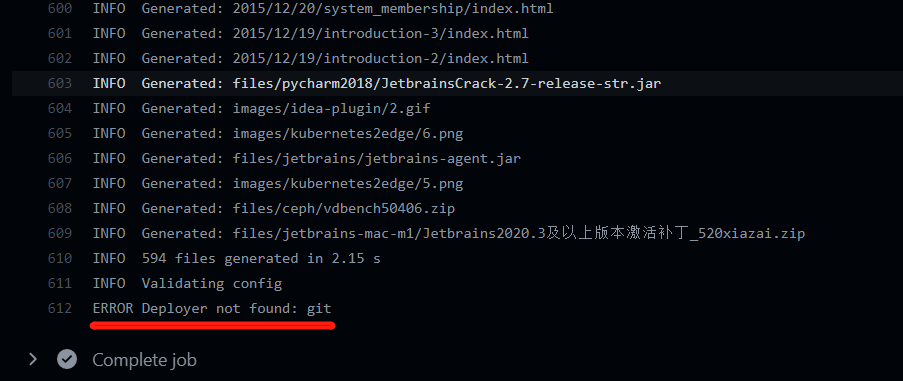
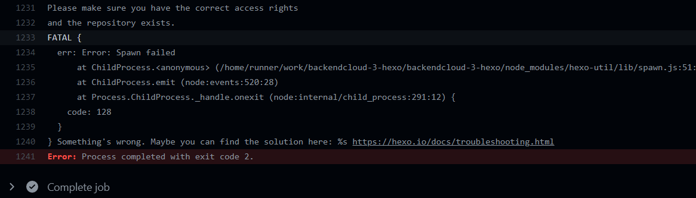
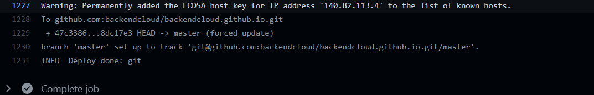
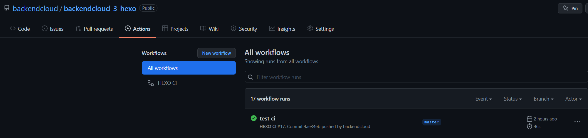
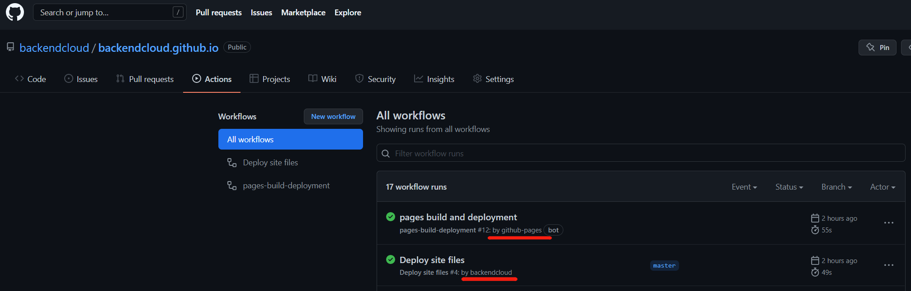

release time :2022-04-03 00:17


# CICD program upgrade
In the past, the blog update method was: execute hexo g -d, compile and deploy to Alibaba Cloud, and git version management push to Github.

Since I tried Github Action last time, I feel that I should keep up with the technology trend and use Github Action to complete CICD automation. In fact, the efficiency did not improve afterwards, but dropped, because the hexo g -dcompilation and deployment took a total of one or two seconds. Switching to the new process only saves hexo g -dthis step, leaving only push to Github, but it takes about 30 to 60 seconds for Github Action to automatically execute this process.

It used to take 2 seconds to see the effect of the blog update, but now it takes nearly 1 minute to see it. In terms of convenience and efficiency, there is no optimization, but the process is greatly upgraded. The CICD idea has obvious advantages in large-scale projects. And the node environment can be used locally, and hexo does not need to be installed. It is especially convenient to switch between multiple computers and multiple environments, and it is convenient for multiple people to edit collaboratively.

Three CICD upgrade options:

1. CI process of the Hexo code warehouse: monitor the push to the static directory public, then use rsync to synchronize the nginx html directory of Alibaba Cloud. This approach also requires local execution hexo g.
2. Hexo code warehouse CI process: monitor the source file folder has a push, then deploy the node environment, install hexo, install the local package, execute hexo g -d, and deploy to the nginx html directory of Alibaba Cloud through hexo rsync.
3. The ultimate solution, dual code warehouse, hexo code warehouse and static web page code warehouse. CI process of the Hexo code warehouse: Monitor the source file folder for push, then deploy the node environment, install hexo, install the local package, execute hexo g -d, deploy to the Github static web warehouse through hexo git and trigger the CI process of the static web warehouse: deploy through rsync Go to the nginx html directory of Alibaba Cloud.

> The advantage of dual warehouses is that the hexo framework is separated from the static web page, and the unblocking of Github may come one day. You can replace a domestic cloud service provider with Github static web page service at any time. The second code warehouse also tosses the CICD process to deploy to Alibaba Cloud for this reason: for domestic acceleration

Since scheme 3 already includes all the implementations of 1 and 2, scheme 3 will be introduced.

# Hexo code warehouse CICD configuration

```yaml
name: HEXO CI

#Invalid workflow file: .github/workflows/ci.yml#L1
#  you may only define one of `paths` and `paths-ignore` for a single event
on:
  push:
    branches:
      - master 
    paths-ignore: 
      - README.md
      - LICENSE

jobs:
  build:
    runs-on: ubuntu-latest
    strategy:
      matrix:
        node-version: [16.x]

    steps:
      - uses: actions/checkout@v1

      - name: Use Node.js ${{ matrix.node-version }}
        uses: actions/setup-node@v1
        with:
          node-version: ${{ matrix.node-version }}

      - name: Configuration environment
        env:
          HEXO_DEPLOY_PRI: ${{ secrets.DEPLOY_KEY }}
        run: |
          mkdir -p ~/.ssh/
          echo "$HEXO_DEPLOY_PRI" > ~/.ssh/id_rsa
          chmod 600 ~/.ssh/id_rsa
          ssh-keyscan github.com >> ~/.ssh/known_hosts
          git config --global user.name "hanwei"
          git config --global user.email "backendcloud@gmail.com"
      - name: Install dependencies
        run: |
          npm i -g hexo-cli
          npm i
          npm install hexo-deployer-git --save
      - name: Deploy hexo
        run: |
          hexo clean && hexo generate
          mkdir -p ./public/.github/workflows
          cp ./backendcloud.github.io.ci.yml ./public/.github/workflows/ci.yml
          hexo deploy
```

# Static web page code warehouse CICD configuration

```yaml
name: Deploy site files

on:
  push:
    branches:
      - master 
    paths-ignore: 
      - README.md
      - LICENSE

jobs:
  deploy:
    runs-on: ubuntu-latest 

    steps: 
      - uses: actions/checkout@v2

      - name: Deploy to Server 
        uses: AEnterprise/rsync-deploy@v1.0 
        env:
          DEPLOY_KEY: ${{ secrets.DEPLOY_KEY }} 
          ARGS: -avz --delete --exclude='*.pyc'
          SERVER_PORT: "22" # SSH端口
          FOLDER: ./ 
          SERVER_IP: ${{ secrets.SSH_HOST }}
          USERNAME: root 
          SERVER_DESTINATION: /usr/share/nginx/html/backendcloud/www/
      - name: Restart server # 第三步，重启服务
        uses: appleboy/ssh-action@master
        with:
          host: ${{ secrets.SSH_HOST }} 
          username: root
          key: ${{ secrets.DEPLOY_KEY }}
          script: |
            rm -rf /usr/share/nginx/html/backendcloud/www/.git*
```


Hexo git deployconfiguration

    deploy:
    type: git
    repo: git@github.com:backendcloud/backendcloud.github.io.git
    # example, https://github.com/hexojs/hexojs.github.io
    branch: master
    ignore_hidden:
        public: false


# Run through the pits encountered along the way
## paths-ignore and paths cannot exist at the same time.
```yaml
on:
  push:
    branches:
      - master 
    paths-ignore: 
      - README.md
      - LICENSE
    paths: 
      - './source/_posts/**'
```

/images/blog-cicd


    Invalid workflow file: .github/workflows/ci.yml#L1
    you may only define one of `paths` and `paths-ignore` for a single event

## The wrong open source component was selected in the rsync use market
burnett01/rsync-deployments@5.2 I don't know where is the problem


Use changed a: AEnterprise/rsync-deploy@v1.0 immediately normal.

## hexo git not found


need to be in

   - name: Install dependencies
           run: |
             npm i -g hexo-cli
             npm i
         - name: Deploy hexo
           run: |
             hexo clean && hexo generate

add onenpm install hexo-deployer-git --save

   - name: Install dependencies
           run: |
             npm i -g hexo-cli
             npm i
             npm install hexo-deployer-git --save
         - name: Deploy hexo
           run: |
             hexo clean && hexo generate

## There is no permission to push to the static web repository



You need to configure the public key in the Github warehouse Settingslabel of the static web page. The public key needs to be consistent with the private key in the container in the github action.

## Pushing to the static web repository is normal, Github can see the latest pushed code repository, but the CI configuration file of the repository is always missing


   - name: Deploy hexo
     run: |
       hexo clean && hexo generate
       mkdir -p ./public/.github/workflows
       cp ./backendcloud.github.io.ci.yml ./public/.github/workflows/ci.yml
       hexo deploy

The CI configuration file of the Hexo code warehouse has a copy-write command, but the static web page code warehouse cannot always be found. After debugging several times, it was confirmed that there is no problem with the code. After debugging, it is found that non-hidden files can be seen, but hidden files cannot be seen. I wonder if hexo git will not push to hidden files by default. Go to the open source hexo git to check, sure enough.

> https://github.com/hexojs/hexo-deployer-git

Hexo git deployconfig from below

    deploy:
    type: git
    repo: git@github.com:backendcloud/backendcloud.github.io.git
    # example, https://github.com/hexojs/hexojs.github.io
    branch: master

changed to

    deploy:
    type: git
    repo: git@github.com:backendcloud/backendcloud.github.io.git
    # example, https://github.com/hexojs/hexojs.github.io
    branch: master
    ignore_hidden:
        public: false


everything is normal.

Another place stepped on a small hole:

these two sentences

    mkdir -p ./public/.github/workflows
    cp ./backendcloud.github.io.ci.yml ./public/.github/workflows/ci.yml

It cannot be placed hexo clean && hexo generatebefore, only after. Because hexo clean will empty the publicfolder.

So far, the three Github Action CICD process of the dual code warehouse has completely run through.



