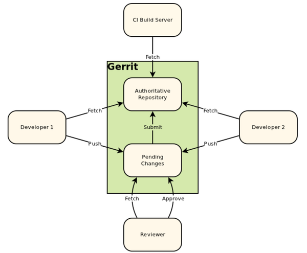

release time :2017-06-28 15:51

Gerrit is the current mainstream code review tool. It directly adds a layer of code review verification to code push and code merge, and it is also an important link and tool in the continuous integration tool chain.

The gerrit deployment process is as follows:

1. Install jdk1.8
2. install httpd

Download gerrit, such as: gerrit-2.12.4.war

    Gerrit 2.12.4 https://www.gerritcodereview.com/download/gerrit-2.12.4.war

gerrit management account

    sudo adduser gerrit
    sudo passwd gerrit

And add gerrit to sudo permission

    sudo visudo
    gerrit  ALL=(ALL:ALL) ALL

install gerrit

    java -jar gerrit-2.11.3.war init

Start the gerrit service

    [gerrit@promote review2]$ /etc/init.d/gerrit.sh start
    ** ERROR: GERRIT_SITE not set
    [gerrit@promote review2]$ pwd
    /home/gerrit/review2
    [gerrit@promote review2]$ /etc/init.d/gerrit.sh start
    ** ERROR: GERRIT_SITE not set
    [gerrit@promote review2]$ export GERRIT_SITE=/home/gerrit/review2
    [gerrit@promote review2]$ /etc/init.d/gerrit.sh status
    Checking arguments to Gerrit Code Review:
    GERRIT_SITE     =  /home/gerrit/review2
    GERRIT_CONFIG   =  /home/gerrit/review2/etc/gerrit.config
    GERRIT_PID      =  /home/gerrit/review2/logs/gerrit.pid
    GERRIT_TMP      =  /home/gerrit/review2/tmp
    GERRIT_WAR      =  /home/gerrit/review2/bin/gerrit.war
    GERRIT_FDS      =  1024
    GERRIT_USER     =  gerrit
    JAVA            =  /usr/lib/jvm/java-1.7.0-openjdk-1.7.0.141-2.6.10.1.el7_3.x86_64/jre/bin/java
    JAVA_OPTIONS    =  
    RUN_EXEC        =  /usr/bin/perl -e '$x=$ENV{JAVA};exec $x @ARGV;die $!' -- GerritCodeReview
    RUN_ARGS        =  -jar /home/gerrit/review2/bin/gerrit.war daemon -d /home/gerrit/review2

    [gerrit@promote review2]$ /etc/init.d/gerrit.sh start
    Starting Gerrit Code Review: OK
    [root@promote etc]# cd /etc/httpd/
    [root@promote httpd]# ls
    conf  conf.d  conf.modules.d  logs  modules  run
    [root@promote httpd]# cd conf.d/
    [root@promote conf.d]# ls
    autoindex.conf  gerrit.conf  README  userdir.conf  welcome.conf

Modify the configuration file as needed

    [root@promote conf.d]# vim gerrit.conf 

Configure the gerrit account password

    [root@promote ~]# htpasswd -m /etc/gerrit.passwd hanwei
    htpasswd: cannot modify file /etc/gerrit.passwd; use '-c' to create it
    [root@promote ~]# touch /etc/gerrit.passwd
    [root@promote ~]# htpasswd -m /etc/gerrit.passwd hanwei
    New password: 
    Re-type new password: 
    Adding password for user hanwei

Open the browser, open the main interface of gerrit, and log in to gerrit with the account just created.