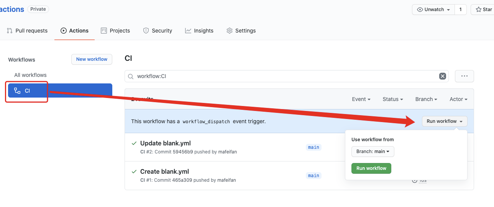
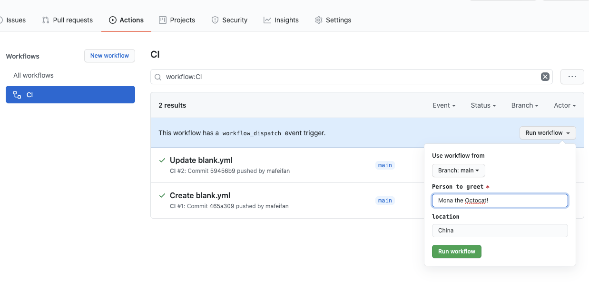
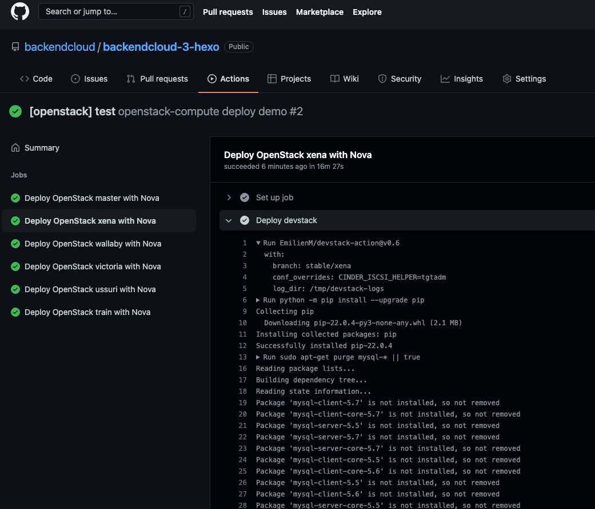
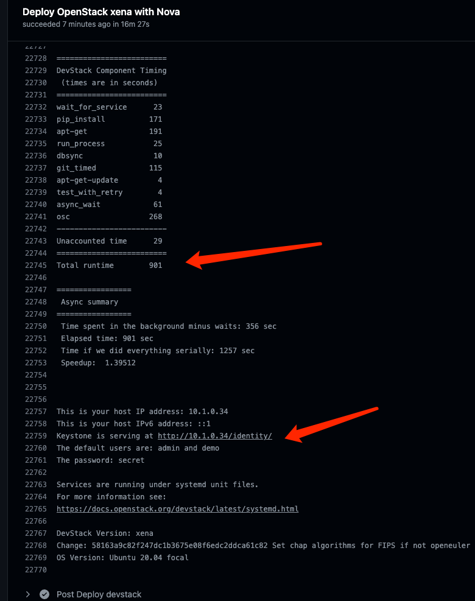

release time :2022-04-12 13:04


# Restrictions on the use of Github Actions
A total usage time limit of 2000 minutes/month, a job in each Workflow can be executed for a maximum of 6 hours, a Workflow can be executed for a maximum of 72 hours, a job in a Workflow can be queued for a maximum of 24 hours in all Actions in a repository, A maximum of 1,000 API requests can be executed in one hour. Number of concurrent jobs: Linux: 20, Mac: 5.

> These restrictions are sufficient for personal development. Of course, it also restricts the use of Github resources as a server. Github has the action of Github as a server. With this action, you can ssh to the Github server to use the server's computing power. Github's server performance is still very strong.


# What is Workflow
A Workflow is a configurable automated process consisting of one or more jobs. You can customize the name, and the Github Action page will display the customized name, otherwise use the default naming method.

on can define the name of the event that triggers the execution of Workflow. Below are the two most commonly used.

    // single event
    on: push

    // multiple events
    on: [push,pull_request]


# What is a Workflow job? And how to share data between different jobs
A Workflow consists of one or more jobs, which means a continuous integration operation that can complete multiple tasks. Github tasks are called steps, and a step can have multiple actions.

Because a job corresponds to a continuous integration. Different jobs cannot share data. The workflow defined by hexo twice in ci.yaml above is a single job. Github executes multiple jobs in parallel by default.

The job must define the id, and the id is the key. This is different from the step. The id and name of the step are defined by the key value pair, and different steps are in the form of an array, and are executed sequentially in the order of writing. The name of the job will be displayed on the Github Action page.

    jobs:
        my_first_job:
            name: My first job
        my_second_job:
            name: My second job


needs can identify whether the job depends on other jobs - if the job fails, all jobs that require the job will be skipped

    jobs:
        job1:
        job2:
            needs: job1
        job3:
            needs: [job1, job2]


How to share data between different jobs can share data between workflow jobs by cooperating with need to share string variables or artifacts

# Cooperate with need to share string variables

    jobs:
    job1:
        runs-on: ubuntu-latest
        # Map a step output to a job output
        outputs:
        output1: ${{ steps.step1.outputs.test }}
        output2: ${{ steps.step2.outputs.test }}
        steps:
        - id: step1
        run: echo "::set-output name=test::hello"
        - id: step2
        run: echo "::set-output name=test::world"
    job2:
        runs-on: ubuntu-latest
        needs: job1
        steps:
        - run: echo ${{needs.job1.outputs.output1}} ${{needs.job1.outputs.output2}}

# Artifacts share data between workflow jobs
Github actions Artifact can be used to store the products produced by actions, such as static files generated by npm build. After the upload is successful, the subsequent process can download these files for use.

One of the jobs is to upload files to Github actions Artifact, use actions/upload-artifact@v2

    - uses: actions/upload-artifact@v2
    with:
    name: agileconfig-ui  
    path: xxx/yyy/

Another job needs a job that needs to upload files, use uses actions/download-artifact@v2

    - uses: actions/download-artifact@v2
    with:
        name: agileconfig-ui  
        path: aaa/bbb   

> Github actions Artifact can not only share files with different jobs, but also manually download files to Github Action, such as compiling and packaging files.

# Define environment variables
Job defines environment variables

    jobs:
        job1:
            env:
                FIRST_NAME: Mona

step defines environment variables

    steps:
    - name: Print a greeting
    env:
        MY_VAR: Hi there! My name is
        FIRST_NAME: Mona
        MIDDLE_NAME: The
        LAST_NAME: Octocat
    run: |
        echo $MY_VAR $FIRST_NAME $MIDDLE_NAME $LAST_NAME


# What is a matrix?
Just sometimes, our code may have multiple compilation environments. We need to compile the dmg compressed package on macos and compile the exe executable file on windows. At this time, we can use the matrix~

For example, in the following code, we use the matrix to specify: 2 operating systems, 3 node versions.

At this time, the following code will be executed 6 times - 2 x 3 = 6! ! !

    runs-on: ${{ matrix.os }}
    strategy:
    matrix:
        os: [ubuntu-16.04, ubuntu-18.04]
        node: [6, 8, 10]
    steps:
    - uses: actions/setup-node@v1
        with:
        node-version: ${{ matrix.node }}


# Skip Github Actions or optionally execute CICD process
As long as the following keywords are included in the commit information, CI will be skipped and CI Build will not be triggered

    [skip ci]
    [ci skip]
    [no ci]
    [skip actions]
    [actions skip]


Requirement: I don't want to trigger Github Actions build every time I commit, only when the git commit message does not contain the specified content.

Github Actions supports jobs..if (opens new window) syntax During the operation of Github Actions, we can get some current environment information, such as git submission content information, and control the execution of actions through these contents

For example, a build is only triggered when the git message does not contain wip

    jobs:
        format:
            runs-on: ubuntu-latest
            if: "! contains(github.event.head_commit.message, 'wip')"

In the same way, the following workflow indicates that the build will only be triggered if the git message contains [build], otherwise it will be skipped

    jobs:
        format:
            runs-on: ubuntu-latest
            if: "contains(github.event.head_commit.message, '[build]')"


# How to manually trigger a build
By default, only push and pull request actions will trigger the build

    on:
        push:
            branches: [ main ]
        pull_request:
            branches: [ main ]

The easiest way is to add workflow_dispatch action

    on:
        workflow_dispatch:
        push:
            branches: [ main ]
        pull_request:
            branches: [ main ]

In this way, you can see the button to execute the build on the actions page, and you can execute a manual build after selecting a branch.




    on:
    workflow_dispatch:
        inputs:
        name:
            description: 'Person to greet'
            required: true
            default: 'Mona the Octocat'
        home:
            description: 'location'
            required: false

    jobs:
    say_hello:
        runs-on: ubuntu-latest
        steps:
        - run: |
            echo "Hello ${{ github.event.inputs.name }}!"
            echo "- in ${{ github.event.inputs.home }}!"




# Code inspection takes bash script inspection as an example

```yaml
name: shellcheck
'on':
  push:
  pull_request:
  schedule:
    - cron: '0 1 * * *'

jobs:

  shellcheck:
    name: shellcheck
    runs-on: ubuntu-latest

    steps:
      - name: Check out the codebase.
        uses: actions/checkout@v2

      - name: Install shellcheck from GitHub releases
        run: |
          sudo curl -L https://github.com/koalaman/shellcheck/releases/download/v${SHELLCHECK_VERSION}/shellcheck-v${SHELLCHECK_VERSION}.$(uname -s).$(uname -m).tar.xz -o shellcheck.tar.xz
          sudo tar -xvf shellcheck.tar.xz
          sudo mv shellcheck-v${SHELLCHECK_VERSION}/shellcheck /usr/local/bin/shellcheck
          sudo chmod 755 /usr/local/bin/shellcheck
          shellcheck --version
        env:
          SHELLCHECK_VERSION: 0.7.2

      - name: Shellcheck!
        run: |
          shellcheck <code path>
          shellcheck <code path>
```

# GitHub Actions Build Android

```yaml
name: android_build

on:
  workflow_dispatch:

jobs:
  build:
    runs-on: ubuntu-latest
    steps:
      - name: Checkout the code
        # 拉取 android_builder 的源代码
        uses: actions/checkout@v2
      - name: Set up JDK
        # 设置 Java 运行环境
        uses: actions/setup-java@v1
        with:
          java-version: 1.8
          # 用 1.8 版本覆盖环境中自带的 Java 11 版本
      - id: get-project
        # 读取项目地址
        name: Get project name
        run: echo "::set-output name=PROJECT::$(cat project-to-build)"
      - name: Clone project
        # 拉取项目源码到虚拟环境
        run: git clone --depth=1 ${{ steps.get-project.outputs.PROJECT }} project
      - name: Build the app
        # 构建调试版 APK
        working-directory: ./project
        run: |
          if [ ! -f "gradlew" ]; then gradle wrapper; fi
          chmod +x gradlew
          ./gradlew assembleDebug --stacktrace
      - name: Upload APK
        # 打包上传生成的 APK 到的网页端
        uses: actions/upload-artifact@v2
        with:
          name: my-build-apk
          path: ./**/*.apk
```


# Docker build image and push to Docker Hub
Go to https://hub.docker.com/settings/security to generate an access token, and remember it well. Then open Github to Settings > Secrets > New secret to add two records:
* Key name: DOCKER_HUB_USERNAME, value is the username of Docker hub
* Key name: DOCKER_HUB_ACCESS_TOKEN, the value is the access token just copied, the value is similar to c292155d-1bd7-xxxx-xxxx-4da75bedb178

```yaml
name: CI to Docker Hub 

on:
  push:
        branches: [ master ]
   # tags:
   #   - "v*.*.*"

jobs:

  build:
    runs-on: ubuntu-latest
    steps:
      -
        name: Set up Docker Buildx
        uses: docker/setup-buildx-action@v1
      -
        name: Login to DockerHub
        uses: docker/login-action@v1 
        with:
          username: ${{ secrets.DOCKER_HUB_USERNAME }}
          password: ${{ secrets.DOCKER_HUB_ACCESS_TOKEN }}
      -
        name: Build and push
        id: docker_build
        uses: docker/build-push-action@v2
        with:
          push: true
          tags: finleyma/simplewhale:latest
          build-args: |
            arg1=value1
            arg2=value2
      -
        name: Image digest
        run: echo ${{ steps.docker_build.outputs.digest }}
```


# Github Action Deploy Openstack environment

The following two examples are examples in the latest Openstack versions TX 部署nova等基本服务and部署Ironic等服务

```yaml
jobs:
  functional-compute:
    strategy:
      fail-fast: false
      matrix:
        name: ["master"]
        openstack_version: ["master"]
        ubuntu_version: ["20.04"]
        include:
          - name: "xena"
            openstack_version: "stable/xena"
            ubuntu_version: "20.04"
          - name: "wallaby"
            openstack_version: "stable/wallaby"
            ubuntu_version: "20.04"
          - name: "victoria"
            openstack_version: "stable/victoria"
            ubuntu_version: "20.04"
          - name: "ussuri"
            openstack_version: "stable/ussuri"
            ubuntu_version: "18.04"
          - name: "train"
            openstack_version: "stable/train"
            ubuntu_version: "18.04"
    runs-on: ubuntu-${{ matrix.ubuntu_version }}
    name: Deploy OpenStack ${{ matrix.name }} with Nova and run compute acceptance tests
    steps:
      - name: Deploy devstack
        uses: EmilienM/devstack-action@v0.6
        with:
          branch: ${{ matrix.openstack_version }}
          conf_overrides: |
            CINDER_ISCSI_HELPER=tgtadm
```

```yaml
jobs:
  functional-baremetal:
    strategy:
      fail-fast: false
      matrix:
        name: ["master"]
        openstack_version: ["master"]
        ubuntu_version: ["20.04"]
        include:
          - name: "xena"
            openstack_version: "stable/xena"
            ubuntu_version: "20.04"
          - name: "wallaby"
            openstack_version: "stable/wallaby"
            ubuntu_version: "20.04"
          - name: "victoria"
            openstack_version: "stable/victoria"
            ubuntu_version: "20.04"
          - name: "ussuri"
            openstack_version: "stable/ussuri"
            ubuntu_version: "18.04"
          - name: "train"
            openstack_version: "stable/train"
            ubuntu_version: "18.04"
    runs-on: ubuntu-${{ matrix.ubuntu_version }}
    name: Deploy OpenStack ${{ matrix.name }} with Ironic and run baremetal acceptance tests
    steps:
      - name: Deploy devstack
        uses: EmilienM/devstack-action@v0.6
        with:
          branch: ${{ matrix.openstack_version }}
          conf_overrides: |
            enable_plugin ironic https://opendev.org/openstack/ironic ${{ matrix.openstack_version }}
            LIBS_FROM_GIT=pyghmi,virtualbmc
            FORCE_CONFIG_DRIVE=True
            Q_AGENT=openvswitch
            Q_ML2_TENANT_NETWORK_TYPE=vxlan
            Q_ML2_PLUGIN_MECHANISM_DRIVERS=openvswitch
            DEFAULT_INSTANCE_TYPE=baremetal
            OVERRIDE_PUBLIC_BRIDGE_MTU=1400
            VIRT_DRIVER=ironic
            BUILD_TIMEOUT=1800
            SERVICE_TIMEOUT=90
            GLANCE_LIMIT_IMAGE_SIZE_TOTAL=5000
            Q_USE_SECGROUP=False
            API_WORKERS=1
            IRONIC_BAREMETAL_BASIC_OPS=True
            IRONIC_BUILD_DEPLOY_RAMDISK=False
            IRONIC_AUTOMATED_CLEAN_ENABLED=False
            IRONIC_CALLBACK_TIMEOUT=600
            IRONIC_DEPLOY_DRIVER=ipmi
            IRONIC_INSPECTOR_BUILD_RAMDISK=False
            IRONIC_RAMDISK_TYPE=tinyipa
            IRONIC_TEMPEST_BUILD_TIMEOUT=720
            IRONIC_TEMPEST_WHOLE_DISK_IMAGE=False
            IRONIC_VM_COUNT=1
            IRONIC_VM_EPHEMERAL_DISK=1
            IRONIC_VM_LOG_DIR=/opt/stack/new/ironic-bm-logs
            IRONIC_VM_SPECS_RAM=1024
            IRONIC_DEFAULT_DEPLOY_INTERFACE=direct
            IRONIC_ENABLED_DEPLOY_INTERFACES=direct
            SWIFT_ENABLE_TEMPURLS=True
            SWIFT_TEMPURL_KEY=secretkey
          enabled_services: 'ir-api,ir-cond,s-account,s-container,s-object,s-proxy,q-svc,q-agt,q-dhcp,q-l3,q-meta,-cinder,-c-sch,-c-api,-c-vol,-c-bak,-ovn,-ovn-controller,-ovn-northd,-q-ovn-metadata-agent'
```





In this way, the parallel preparation of 5 or 6 latest versions of the openstack environment is automatically completed in just one meal.
