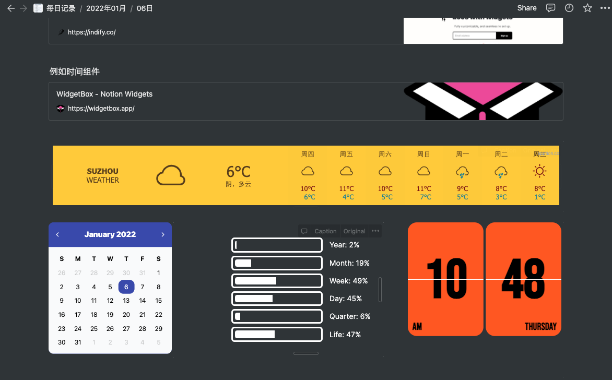
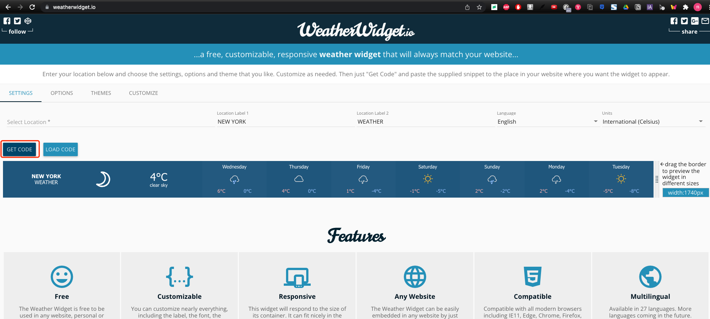
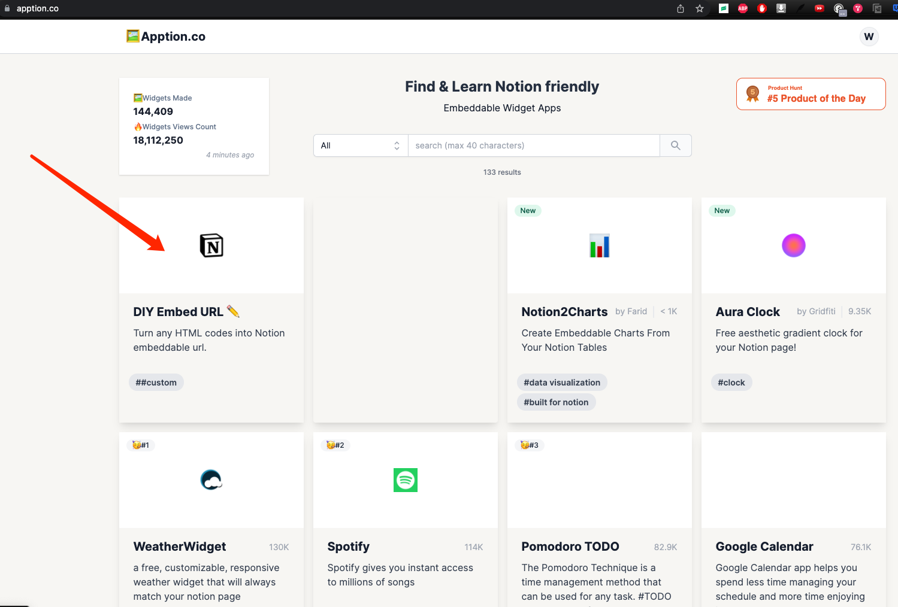
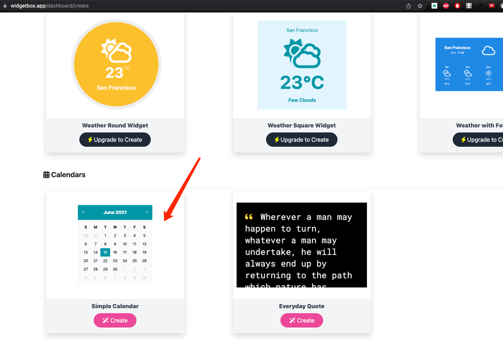
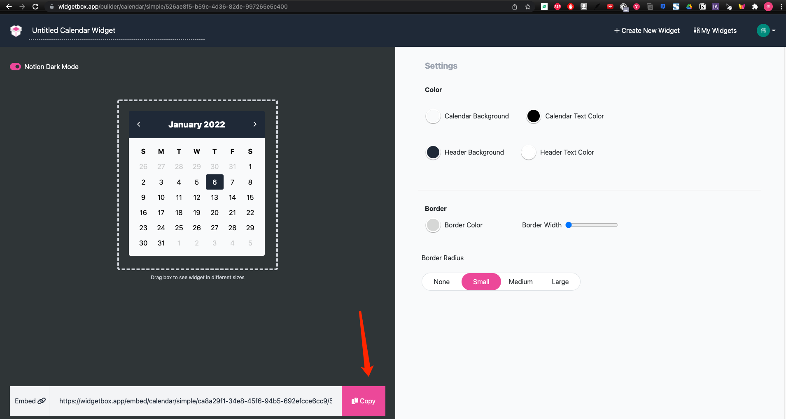
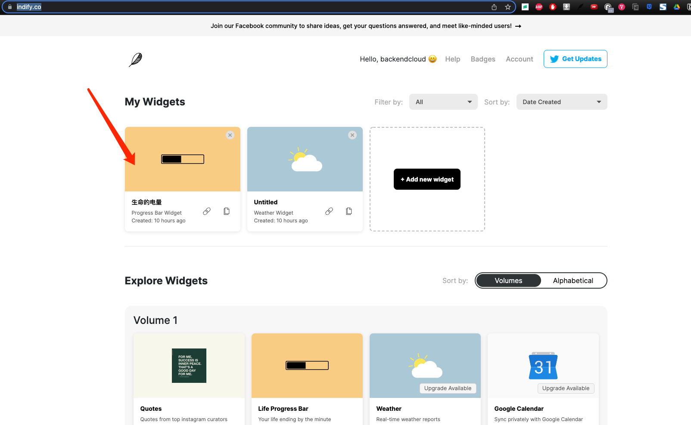
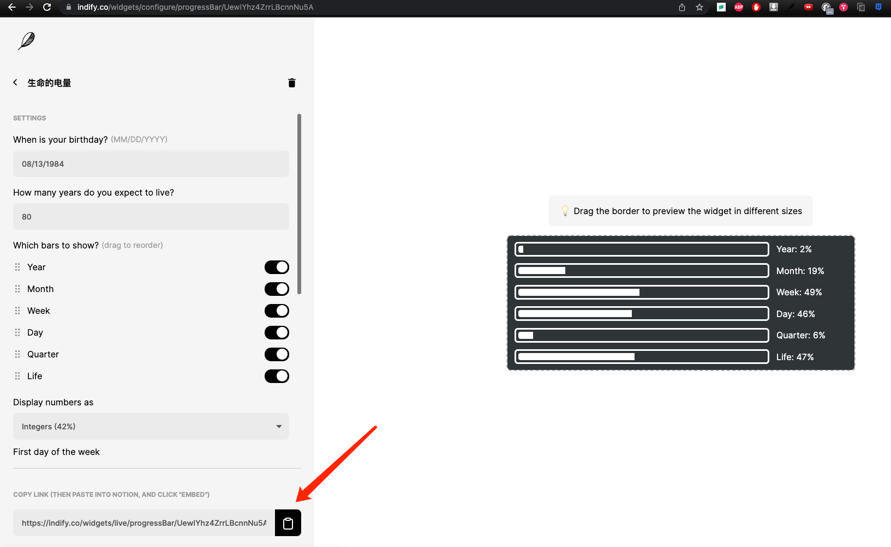
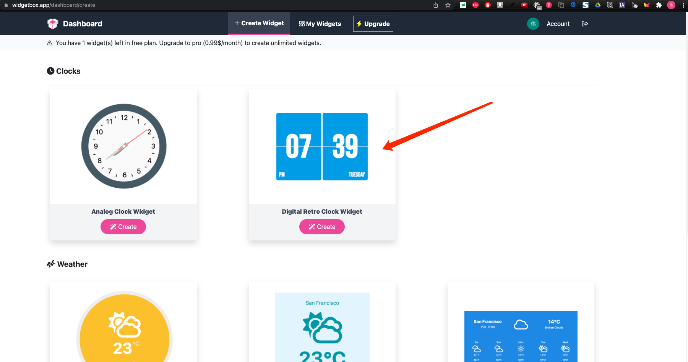
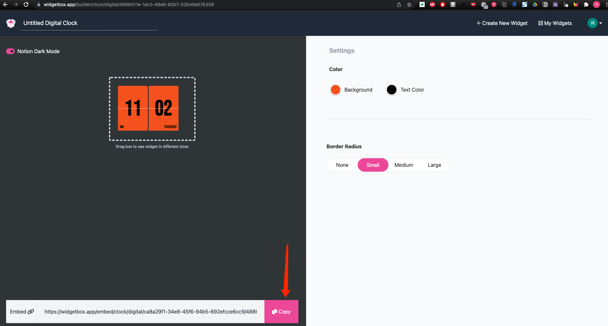

release time :2022-01-06 11:06

# What is Widget
Widget is not a small app, it is a new form of desktop content presentation, mainly used to make up for the main application's inability to display the data that users care about in time.

An excellent Widget needs to have three characteristics: simple and clear (Glanceable), appropriate display (Relevant), and personalized customization (Personalized).

# Notion's page insertion widget
The pages of Notion can be easily inserted into widgets like the IOS system and Hongmeng system. As shown below:

There are many controls, you can try them out in the links in the article. Let’s take the 4 small controls in the picture above as examples: the weather for the next 7 days, the current calendar, the remaining battery life, and the current time.

## Next 7 days weather component
[WeatherWidget.io](https://weatherwidget.io/)

Click the Get Code get codebutton

    <a class="weatherwidget-io" href="https://forecast7.com/en/40d71n74d01/new-york/" data-label_1="NEW YORK" data-label_2="WEATHER" data-theme="original" >NEW YORK WEATHER</a>
    

After copying the code, you cannot paste Notion directly, it can only be a large piece of code, go to

[Apption - Notion friendly Embeddable Widget Apps](https://apption.co/)

Generate url, put the url into the embed block of notion

## current calendar component

[WidgetBox - Notion Widgets](https://widgetbox.app/)

After configuring the appearance, copy the url and put the url in the embed block of notion.

## The remaining power of life 🔋 components
[Indify - Notion Widgets](https://indify.co/)

After configuring the appearance, copy the url and put the url in the embed block of notion

## current time component
[WidgetBox - Notion Widgets](https://widgetbox.app/)

After configuring the appearance, copy the url and put the url in the embed block of notion.

